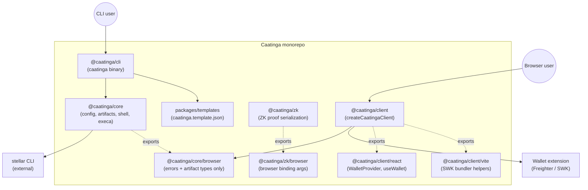

# Architecture

This document is the **canonical product and architecture stance** for Caatinga. It complements package-level code and the CLI reference in `docs/cli.md`. Detailed rationale for selected decisions lives in [Architecture Decision Records](./adr/index.md) under `docs/adr/`.

## One-sentence promise

**Git-versioned Soroban deploy artifacts + multi-contract orchestration for TypeScript teams that want sovereignty — from scaffold to wallet-ready browser client without a hosted registry.**

That does not mean hiding Stellar reality. Users keep a **stable Caatinga surface** (`caatinga build`, `caatinga deploy`, `caatinga generate`, `caatinga invoke`, `@caatinga/client`). Changes in flags, stdout, paths, transaction/XDR workflow, and subprocess composition are absorbed behind small adapters, not scattered across user scripts.

## What Caatinga is (and is not)

| Caatinga is                                                          | Caatinga is not                                                                |
| -------------------------------------------------------------------- | ------------------------------------------------------------------------------ |
| Convention + orchestration + artifacts + frontend/client integration | A second Soroban/Stellar SDK                                                   |
| A thin CLI over `@caatinga/core`                                     | A place to store private keys or run silent signing                            |
| Template-driven project scaffolding                                  | A hosted registry required for core workflows (future registries are optional) |

**Primary competitor today:** ad-hoc `package.json` scripts.

**Direct ecosystem overlap:** [Scaffold Stellar](https://developers.stellar.org/docs/tools/scaffold-stellar) (`stellar scaffold` + `stellar registry`, official templates, `environments.toml`, Vite/React frontend).

**Caatinga differentiation:** npm-first TypeScript toolkit (`@caatinga/cli`, `@caatinga/core`, `@caatinga/client`), `caatinga.config.ts` + `caatinga.artifacts.json` as the per-network artifacts contract, `CAATINGA_*` error codes as a public API, explicit wallet adapters, and multi-contract orchestration via `dependsOn` — without an on-chain registry or Rust macro layer.

### Caatinga vs Scaffold Stellar

| Dimension           | Caatinga                                            | Scaffold Stellar                                             |
| ------------------- | --------------------------------------------------- | ------------------------------------------------------------ |
| Entry point         | `npm install -g @caatinga/cli`                      | Stellar CLI plugins (`stellar scaffold`, `stellar registry`) |
| Config contract     | `caatinga.config.ts` + `caatinga.artifacts.json`    | `environments.toml` + registry naming                        |
| Deploy model        | Stellar CLI subprocess + per-network artifacts file | On-chain registry publish/deploy workflow                    |
| Browser integration | `@caatinga/client` with pluggable wallet adapters   | Generated TS clients + Vite/React template                   |
| Error surface       | Stable `CAATINGA_*` codes for automation            | Stellar CLI / plugin errors                                  |

**What Caatinga should do unusually well:** (1) persist **git-versioned per-network** deployment artifacts, (2) orchestrate **multi-contract** deploy graphs with `dependsOn`, (3) ship **wallet-ready browser client** integration, (4) track **binding freshness**, and (5) lower friction for JS/TS teams — CLI orchestration is infrastructure supporting those outcomes, not the headline value.

## Competitive moat

| Moat                            | Why it matters                                                                             |
| ------------------------------- | ------------------------------------------------------------------------------------------ |
| Portable artifacts file         | Exit Caatinga without losing deploy history — `caatinga.artifacts.json` stays in your repo |
| `CAATINGA_*` error API          | Stable automation surface for CI/CD                                                        |
| Parser fixtures + adapters      | Absorb Stellar CLI stdout drift without user script churn                                  |
| npm-first, no on-chain registry | Sovereignty for teams that reject mandatory registry workflows                             |
| Multi-contract DAG deploy       | Topological deploy + `${contracts.*.contractId}` placeholders                              |

**Honest risk:** SDF may integrate overlapping workflow pieces into Stellar CLI or Scaffold Stellar. Caatinga competes on **TypeScript DX + git artifacts + multi-contract orchestration**, not on reimplementing Soroban or replacing the official SDK.

## Validation roadmap (flows)

1. **Alpha flow (current):** `init → build → deploy → generate → invoke` plus `@caatinga/client` for browser-side binding/artifact/wallet interop.
2. **Shipped:** **multi-contract deploy with dependencies** (e.g. deploy token, then a dependent contract such as vault that injects the token's `contractId`, then generate bindings for both, then invoke across that dependency). See [ADR 0005](./adr/0005-multi-contract-dependency-deploy.md).
3. **Next:** upgrade / redeploy with **artifacts history** and clear migration story.

### Alpha flow diagram

```mermaid
flowchart LR
  cfg["caatinga.config.ts<br/>(contracts, networks)"]
  src["contracts/&lt;name&gt;/src/<br/>Rust Soroban source"]
  init["caatinga init<br/>(template + manifest check)"]

  build["caatinga build<br/>(stellar contract build)"]
  wasm["target/wasm32v1-none/release/&lt;name&gt;.wasm"]

  deploy["caatinga deploy<br/>(stellar contract deploy)"]
  artifacts["caatinga.artifacts.json<br/>networks[network].contracts[name].contractId"]

  generate["caatinga generate<br/>(npx @stellar/stellar-sdk generate)"]
  bindings["contracts/generated/&lt;name&gt;.ts<br/>(Client, methods)"]

  invoke["caatinga invoke<br/>(stellar contract invoke)"]

  client["@caatinga/client<br/>(createCaatingaClient)"]
  browser["Browser app<br/>wallet.signTransaction()"]

  cfg --> init
  init --> src
  src --> build
  build --> wasm
  wasm --> deploy
  cfg --> deploy
  deploy --> artifacts
  artifacts --> generate
  wasm --> generate
  generate --> bindings
  artifacts --> invoke
  bindings --> invoke

  artifacts --> client
  bindings --> client
  client --> browser
```

Each box is either a file you commit, a CLI command you run, or a runtime component. The arrows show which inputs are required to start the next step — for example, `deploy` needs both the compiled WASM and the network configuration.

## Package boundaries (monorepo)

- **`@caatinga/cli`:** argument parsing, terminal UX, `doctor` diagnostics, delegation to core—no subprocess orchestration except through core APIs.
- **`@caatinga/core`:** load `caatinga.config.ts`, validate schemas, resolve networks/contracts, read/write `caatinga.artifacts.json`, run Stellar CLI and related tools via a **single shell layer** (`run-command.ts`). **All `execa` usage stays here.**
- **`@caatinga/client`:** thin client/browser interop over generated bindings, artifacts, wallet adapters, `invoke()`, `buildXdr()`, and explicit XDR/raw debug output. It does not own signing keys or serialize SCVal manually. Subpaths: `./react` (WalletProvider/useWallet), `./vite` (bundler helpers), `./freighter`, `./stellar-wallets-kit`.
- **`@caatinga/zk`:** ZK proof serialization, Circom Groth16 workflow helpers, and browser binding args for on-chain verification.
- **`packages/templates`:** official templates consumed by `caatinga init` and validated through `caatinga.template.json` before copy.

Deferred unless explicitly rescoped: CLI XDR commands, `caatinga generate --interop`, full plugin system, RWA-only templates, visual dashboard, custom test runner as **required** core dependencies.

### Package dependency diagram

Notes encoded in the diagram:

- The CLI depends on core, never the other way around.
- `@caatinga/core` is the only package that talks to the `stellar` binary. `@caatinga/client` consumes the browser-safe subpath `@caatinga/core/browser`, which excludes `execa` and Node-only modules so Vite/webpack bundles stay slim.
- `@caatinga/client` does not own wallet state — it composes a wallet adapter (Freighter, Stellar Wallets Kit, or a custom `CaatingaWalletAdapter`). On top of the adapter, `createWalletSession` provides optional connection state, persistence, and silent restore; the `@caatinga/client/react` subpath wraps that session in `WalletProvider`/`useWallet` for React apps (React stays an optional peer).

## Meta-framework boundary: orchestrate workflow, not mental model

**May abstract:** build/deploy/bindings flow, artifact lookup, network config from the project, template layout, command composition, stable CLI commands, wallet adapter handoff, and generated-binding transaction workflow.

**Should not hide** (users and docs should keep these visible): `contractId`, network passphrase, RPC choice, accounts, wallet signing, XDR, fees, simulation, Soroban data model as understood via official SDKs and generated bindings.

**Red flags (avoid):** Caatinga-owned contract models, hand-rolled Soroban serialization, replacing generated bindings as the primary API, custom signing runtimes parallel to the Stellar ecosystem, or “smart” behavior that obscures what actually hit the network.

Rule of thumb: if Stellar CLI, `stellar-sdk`, Soroban SDK, or generated bindings already own it, Caatinga **composes, validates, or organizes**—it does not reimplement.

**Product boundary:** Caatinga ends at the **typed client + resolved contract IDs** (`caatinga.artifacts.json`, generated bindings, synced env). HTTP APIs, databases, async jobs, transaction hash persistence, and caller-specific auth models are application concerns — a green Caatinga pipeline does not imply a green production app. See [production readiness](./production-readiness.md) and the app-side checklist in docs.

## Source of truth (MVP)

Local project state is authoritative:

- `contracts/`
- Generated bindings (path from `caatinga.config.ts`)
- `caatinga.config.ts`
- `caatinga.artifacts.json`

Each generated binding package carries a `.caatinga-bindings.json` marker recording the source
`contractId`, `wasmHash`, and network. `caatinga status`, `doctor`, and `generate` compare the
marker against `caatinga.artifacts.json` to flag stale bindings after a redeploy. The marker is a
sidecar, not part of the artifacts schema: deleting a bindings directory simply resets its state
to `missing`.

No central cache or remote artifact registry is assumed in the core MVP. Optional remote services may exist later but must not be **hard dependencies** of core.

## `caatinga dev`

**MVP direction:** opinionated proxy around **Vite + Caatinga validation** (not a plugin or template store). Official templates are Vite + React only (`vite-react`). Future adapters (`next`, `astro`, custom) are conceivable only after the core workflow and multi-contract story prove value. See [CLI — Supported today vs not yet](./cli.md#supported-today-vs-not-yet).

## Extensibility

- **Templates:** start as **opinionated snapshots** (`react-vite-counter`, etc.). Parameterized generators (`--tailwind`, wallet flavor, i18n) come later—they expand the test matrix quickly.
- **Template contract:** every template includes a **`caatinga.template.json` manifest** (name, version, `compatibleCore`, paths) so templates and core semver are validated at `init`—see [ADR 0003](./adr/0003-template-manifest-compatibility.md).
- **Post-deploy hooks:** `postDeploy`, `postDeployRead`, and `smoke` are first-class config surfaces for wiring, read verification, and CI smoke — see [ADR 0006](./adr/0006-post-deploy-hooks.md) and [Config — postDeploy](./config.md). Expect DSL matchers (`reachable`, `isArray`, etc.) apply to hooks, `caatinga read --expect`, and `caatinga smoke`.
- **Verification layer:** `caatinga smoke`, `caatinga regression`, and `caatinga ci run` compose deploy/generate with read checks. `@caatinga/core` exports `verifyExpect`, `evaluateEnvDrift`, and `runSmokeReads` for custom tooling.
- **Plugins:** still deferred for broader extension points (for example CI presets or indexer hooks). Keep hooks declarative and data-only until a concrete use case requires executable plugin code.

## Ecosystem: official vs community templates

- **Official:** live in the Caatinga repo, reviewed, CI-tested, semver-matrices documented.
- **Community:** installable via Git URL or npm-style packages, **never implicitly trusted**—treat as untrusted code; warn users; avoid auto-running post-install scripts from external templates in MVP-class flows.

**Distribution:** MVP+1 favors **Git + URL** (e.g. `caatinga init my-app --template github:org/repo`). A dedicated template registry is explicitly later—moderation, security, and availability cost.

Suggested naming: `@caatinga/template-*` for official; `@scope/caatinga-template-*` for community.

## Networks vs environments

**Today:** artifacts keyed by **network** (same logical contract may differ per network—correct).

**Future (MVP+1):** **environment** (e.g. `staging` vs `production`) can share a network but differ in deployed `contractId`s. Expect either a new artifacts shape version or an explicit `environments` model—design TBD with migration (`caatinga migrate`) when introduced.

## Multi-contract

Deploy order is supported in core for declared dependencies (DAG / topological sort), with artifact-safe constructor arg injection through `${contracts.<name>.contractId}` — see [ADR 0005](./adr/0005-multi-contract-dependency-deploy.md). The next layer is runtime wiring: `${source.address}`, `postDeploy`, `caatinga wire`, frontend env sync, and workspace builds are covered by [ADR 0006](./adr/0006-post-deploy-hooks.md).

## CI and secrets

Caatinga does **not** manage long-lived private keys. CI provides identities (`--source ci-deployer`), secrets via the platform, and a configured Stellar CLI on the runner. Caatinga validates config, runs deploy/generate/invoke, updates artifacts, and fails with **clear, stable error codes** (see below).

## Client and frontend SDK

`@caatinga/client` provides the browser/client-side interop layer: generated binding registration, artifact-based `contractId` lookup, wallet adapters, `invoke()`, `read()`, `simulate()`, `buildXdr()`, and explicit XDR/raw debug output. The `@caatinga/client/react` subpath ships `WalletProvider` + `useWallet` hooks so React apps stop hand-rolling wallet context — React stays an optional peer. Avoid a parallel generic Soroban client that bypasses generated types.

## DX beyond CLI

Prefer **`caatinga doctor`** (bins, config/artifact sanity, network/source checks, optional staleness hints later) before investing in VS Code/LSP.

## Errors as public API

Stable **`CAATINGA_*` codes** are part of the contract for CI, support, and docs. New public errors must be added through the central `CaatingaErrorCode` object and documented in [`errors.md`](./errors.md)—see [ADR 0004](./adr/0004-error-codes-as-public-api.md).

## Testing strategy vs Stellar CLI drift

Layered approach:

1. Unit tests in `@caatinga/core`.
2. **Fixtures** of Stellar CLI stdout/stderr per supported CLI generation (parsing is the fragile boundary).
3. Contract tests with **pinned** Stellar CLI versions in CI.
4. Optional scheduled smoke against testnet.

The runtime compatibility check (`evaluateStellarCliCompatibility`) intentionally decouples the hard floor (22.x invoke-signing bug) from the last-tested version. Drift above the last-tested version is a non-fatal advisory, not a CI failure, so we can keep one pinned fixture version in CI while still running against whatever Stellar CLI the developer has installed. See the [Stellar CLI version contract](./stellar-cli-version-contract.md) for the operational rules.

## Versioning and migrations

Semver applies to monorepo packages **and** to serialized formats (`caatinga.artifacts.json` already has a `version` field). Breaking format or command behavior should eventually ship with **`caatinga migrate`**—not required on day one, but fields and ADRs should assume migrations will exist.

## Performance responsibilities

- **Rust / Stellar toolchain:** real compile and WASM output.
- **Caatinga:** detect stale WASM vs sources when feasible, avoid redundant `generate`, compare WASM hashes, emit clear “run build first” guidance. MVP: basic checks; later: stronger staleness and caching policies.

## Business stance for the core

**Core stays open-source and neutral** (CLI, core, baseline templates, artifacts, config workflow). Revenue-bearing or hosted offerings, if any, stay **outside** the neutrality of the core dependency graph.

---

## Architecture Decision Records

| ADR                                                      | Status   | Topic                                                                     |
| -------------------------------------------------------- | -------- | ------------------------------------------------------------------------- |
| [0001](./adr/0001-stable-workflow-over-stellar-cli.md)   | Accepted | Stable Caatinga workflow while encapsulating Stellar CLI churn            |
| [0002](./adr/0002-local-artifacts-as-source-of-truth.md) | Accepted | Local artifacts and config as source of truth; no central registry in MVP |
| [0003](./adr/0003-template-manifest-compatibility.md)    | Accepted | Template manifest and core compatibility                                  |
| [0004](./adr/0004-error-codes-as-public-api.md)          | Accepted | Stable `CAATINGA_*` error codes and migration                             |
| [0005](./adr/0005-multi-contract-dependency-deploy.md)   | Accepted | Multi-contract `dependsOn` and contractId injection                       |

**0001–0005** are ratified; multi-contract deploy sequencing and placeholder resolution are implemented in `@caatinga/core` and documented in ADR 0005.

## Related docs

- [`getting-started.md`](./getting-started.md)
- [`cli.md`](./cli.md)
- [`client.md`](./client.md)
- [`config.md`](./config.md)
- [`templates.md`](./templates.md)
- [`errors.md`](./errors.md)
- [`testing.md`](./internal/testing.md)
