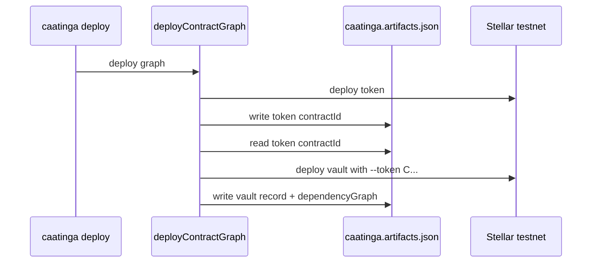

# Case Study: Multi-Contract dApp (Token + Vault)

This case study documents the Sprint 42 dogfood project at [`examples/dogfood-multi`](../../examples/dogfood-multi).

## Problem

A vault contract must be initialized with an already-deployed token contract ID. Manual copy-paste of `C...` addresses breaks across networks and teammates.

## Caatinga solution

1. **Declare the graph** in `caatinga.config.ts` with `dependsOn`.
2. **Reference upstream IDs** with `${contracts.token.contractId}` in `deployArgs`.
3. **Deploy in one command** — core topological-sorts and injects resolved IDs.
4. **Track state** in `caatinga.artifacts.json` per network.

## Config excerpt

```typescript
vault: {
  path: "./contracts/vault",
  wasm: "./contracts/vault/target/wasm32v1-none/release/vault.wasm",
  dependsOn: ["token"],
  deployArgs: {
    token: "${contracts.token.contractId}",
  },
},
```

## Deploy sequence



## Upgrade

After changing token WASM:

```bash
caatinga build token
caatinga upgrade token --network testnet --source alice
```

Vault artifact still references the same token `contractId` unless vault logic changes.

## Validation

```bash
caatinga wire --network testnet --source alice
caatinga smoke --network testnet
caatinga doctor --network testnet
```

## Lessons

- Placeholders only resolve from artifacts — deploy token first or use full-graph deploy.
- Partial deploy recovery: re-run `caatinga deploy`; deployed contracts are skipped.
- See [recovery-scenarios.md](../recovery-scenarios.md) for failure modes.
