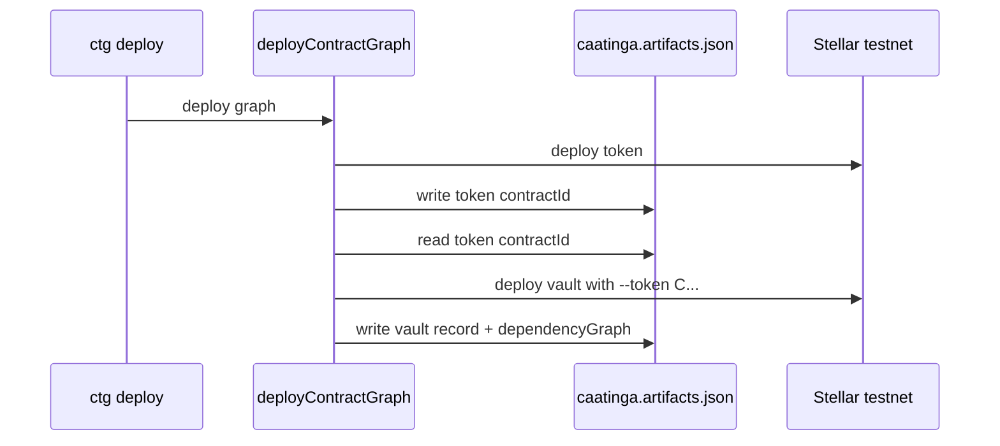

# Case Study: Multi-Contract dApp (Token + Vault)

This case study documents the Sprint 42 dogfood project at [`examples/dogfood-multi`](../../examples/dogfood-multi).

## Problem

A vault contract must be initialized with an already-deployed token contract ID. Manual copy-paste of `C...` addresses breaks across networks and teammates.

## Caatinga solution

1. **Declare the graph** in `caatinga.config.ts` with `dependsOn`.
2. **Reference upstream IDs** with `${contracts.token.contractId}` in `deployArgs`.
3. **Deploy in one command** — core topological-sorts and injects resolved IDs.
4. **Track state** in `caatinga.artifacts.json` per network.

## Config excerpt

```typescript
vault: {
  path: "./contracts/vault",
  wasm: "./contracts/vault/target/wasm32v1-none/release/vault.wasm",
  dependsOn: ["token"],
  deployArgs: {
    token: "${contracts.token.contractId}",
  },
},
```

## Deploy sequence


```mermaid
sequenceDiagram
  participant CLI as ctg deploy
  participant Core as deployContractGraph
  participant Artifacts as caatinga.artifacts.json
  participant Chain as Stellar testnet

  CLI->>Core: deploy graph
  Core->>Chain: deploy token
  Core->>Artifacts: write token contractId
  Core->>Artifacts: read token contractId
  Core->>Chain: deploy vault with --token C...
  Core->>Artifacts: write vault record + dependencyGraph
```

## Upgrade

The dogfood `token` has no `upgrade(new_wasm_hash)` entrypoint, so in-place `ctg upgrade token`
fails (`CAATINGA_INVOKE_FAILED`, with a hint to use `ctg deploy --upgrade`). Upgrade by redeploying
instead. A redeployed token gets a **new** `contractId`, and `vault` stored the old token `Address`
in its constructor, so redeploy the whole graph to re-resolve `${contracts.token.contractId}`:

```bash
ctg build
ctg deploy --network testnet --source alice --upgrade
```

`--upgrade` redeploys every contract in dependency order and records the previous instances in
`history` with reason `upgrade`. For in-place upgrades that keep the same `contractId`, the contract
must expose an admin-gated `upgrade(new_wasm_hash)`; see
[Contract upgrade](../tutorials/contract-upgrade.md).

## Validation

```bash
ctg wire --network testnet --source alice
ctg smoke --network testnet
ctg doctor --network testnet
```

## Lessons

- Placeholders only resolve from artifacts — deploy token first or use full-graph deploy.
- Partial deploy recovery: re-run `ctg deploy`; deployed contracts are skipped.
- See [recovery-scenarios.md](../recovery-scenarios.md) for failure modes.
