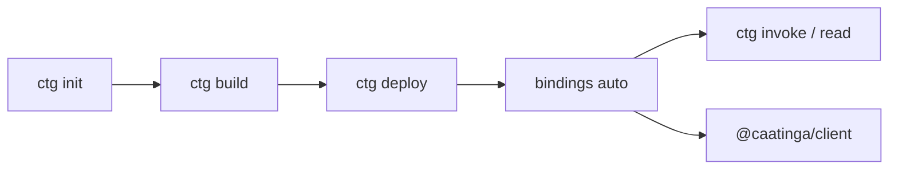

# Caatinga — LLM Reference

> **Quick context:** start at [`llms.txt`](../llms.txt) for identity, mental model, boundaries, and doc routing. This file and [`llms-full.txt`](../llms-full.txt) are the detailed reference.

Caatinga is Deployment Orchestration + Versioned Artifacts for Soroban: local, graph-aware deploy orchestration and portable, Git-versioned artifacts (`caatinga.artifacts.json`) for TypeScript teams. Build/deploy/invoke shell out to Stellar CLI; `ctg generate` runs `npx @stellar/stellar-sdk generate`.

Human docs: [dione-b.github.io/caatinga](https://dione-b.github.io/caatinga/). Authoritative command/API detail: [CLI](./cli.md), [Config](./config.md), [Client](./client.md), [Errors](./errors.md), [Cheatsheet](./cheatsheet.md).

## Install & release

| Item              | Value                                                                                        |
| ----------------- | -------------------------------------------------------------------------------------------- |
| npm dist-tag      | `latest` → **3.9.2** (`@caatinga/cli`, `@caatinga/core`, `@caatinga/client`, `@caatinga/zk`) |
| Status            | **v1.0 stable contract** on npm major `3.x`. Pin an exact version for reproducible installs. |
| Global install    | `npm install -g @caatinga/cli` (binaries: `caatinga`, `ctg`)                                 |
| No global install | `npx ctg <command>` (`caatinga` is a legacy alias)                                           |
| Reproducible CI   | Pin an exact version (e.g. `@caatinga/cli@3.9.2`), not a floating tag                        |
| Fresh machine     | Node 22+, then check with `npx ctg doctor`. Install Rust, Stellar CLI manually.              |
| Stellar CLI       | Hard floor **23.0.0**; last tested **27.0.0**; newer = advisory warning only                 |

See [Public API](./public-api.md) and [Stellar CLI version contract](./stellar-cli-version-contract.md).

## Capability limits

| Capability                     | Status                                                       |
| ------------------------------ | ------------------------------------------------------------ |
| Official frontend templates    | Vite + React only (`vite-react`)                             |
| `ctg zk build`                 | Single-party **dev** ceremony; blocked on mainnet by default |
| `ctg zk invoke --embed-vk`     | Not supported (experimental)                                 |
| Browser `invoke` via wallet    | **Single-invoker only**                                      |
| Multi-signer / `signAuthEntry` | Application code → `CAATINGA_MULTI_AUTH_REQUIRED`            |
| Production ZK (MPC ceremony)   | Out of scope                                                 |

---

## 1. Core Workflow



```bash
npx ctg init my-dapp && cd my-dapp && npm install
npx ctg doctor --network testnet --source alice
npx ctg build counter
npx ctg deploy counter --network testnet --source alice
npx ctg invoke counter.increment --network testnet --source alice
npx ctg read counter.get --network testnet
npx ctg status --network testnet
```

Fresh machine: install Rust + Stellar CLI manually, then `npx ctg doctor` to verify. Full graph: `npx ctg deploy --network testnet --source alice`.

| Strategy     | Command                | `contractId`  |
| ------------ | ---------------------- | ------------- |
| **In-place** | `ctg upgrade`          | **Preserved** |
| **Redeploy** | `ctg deploy --upgrade` | **New ID**    |

Default `react-vite-counter` has no `upgrade()` — use `deploy --upgrade` for that template. See [Contract upgrade](./tutorials/contract-upgrade.md) and [Cheatsheet](./cheatsheet.md).

---

## 2. Package Reference

| Package                                 | Role                                                                  | Browser-safe         |
| --------------------------------------- | --------------------------------------------------------------------- | -------------------- |
| `@caatinga/cli`                         | CLI binary                                                            | No                   |
| `@caatinga/core`                        | Config, artifacts, Stellar CLI orchestration                          | No (`./browser` yes) |
| `@caatinga/client`                      | `createCaatingaClient`, wallet session, invoke/read/simulate/buildXdr | Yes                  |
| `@caatinga/client/react`                | `WalletProvider` + `useWallet`                                        | Yes                  |
| `@caatinga/client/vite`                 | SWK bundler stubs                                                     | Yes                  |
| `@caatinga/client/freighter`            | Freighter adapter                                                     | Yes                  |
| `@caatinga/client/stellar-wallets-kit`  | Multi-wallet adapter                                                  | Yes                  |
| `@caatinga/zk` / `@caatinga/zk/browser` | ZK helpers                                                            | browser subpath      |

---

## 3. CLI — agent-critical rules

Full flags and tables: [CLI](./cli.md) · [Cheatsheet](./cheatsheet.md).

- `--source` = **local Stellar CLI identity alias** (`alice`), never `G...` / `S...` / seed phrase.
- `deploy` auto-generates bindings unless `--no-generate`.
- Full graph deploy (no contract name) auto-runs `wire` + `sync-env` unless `--no-wire` / `--no-sync-env`.
- `doctor --strict` = `--strict-env` + `--strict-bindings` only; deploy coverage never blocks exit code.
- `upgrade` = in-place WASM (same `contractId`); `deploy --upgrade` = new instance + history.
- `status --strict` fails when deployed contracts have bindings other than `fresh`.
- Expect DSL (smoke / `read --expect` / postDeploy): `reachable`, `equals`, `contains`, `matches`, `jsonEquals`, `isArray`, `isNull`, `minLength`, `maxLength` — see [CLI](./cli.md).

Core commands: `init`, `zk init`, `build`, `deploy`, `upgrade`, `generate`, `doctor`, `status`, `invoke`, `read`, `smoke`, `regression`, `ci run`, `wire`, `sync-env`, `estimate deploy`, `inspect`, `migrate artifacts`, `rollback`, `zk build|prove|invoke`. Binary alias: `ctg` ≡ `caatinga`.

---

## 4. Config & artifacts (summary)

Authoritative schema: [Config](./config.md). Minimal shape:

```ts
import { defineConfig } from "@caatinga/core";

export default defineConfig({
  project: "my-dapp",
  contracts: {
    counter: {
      path: "./contracts/counter",
      wasm: "./contracts/counter/target/wasm32v1-none/release/counter.wasm",
      dependsOn: ["token"], // optional
      deployArgs: { tokenContractId: "${contracts.token.contractId}" }, // optional
    },
  },
  networks: {
    testnet: {
      rpcUrl: "https://soroban-testnet.stellar.org",
      networkPassphrase: "Test SDF Network ; September 2015",
    },
  },
  frontend: {
    bindingsOutput: "./src/contracts/generated",
  },
});
```

Placeholders: `${contracts.<name>.contractId}`, `${source.address}`. Load-time validation requires `dependsOn` for every `${contracts.*.contractId}` in `deployArgs`.

Artifacts (`caatinga.artifacts.json`): schema **v2**, git-versioned, per-network `contractId` + `wasmHash` + optional `history`. Migrate with `ctg migrate artifacts`. See [artifacts-spec](./artifacts-spec.md).

---

## 5. Client API (summary)

Full API: [Client](./client.md) · [Wallets](./wallets.md).

```ts
import { createCaatingaClient } from "@caatinga/client";
import { createStellarWalletsKitAdapter } from "@caatinga/client/stellar-wallets-kit";
import * as Counter from "./contracts/generated/counter";
import artifacts from "../caatinga.artifacts.json";

const client = createCaatingaClient({
  network: {
    name: "testnet",
    rpcUrl: "https://soroban-testnet.stellar.org",
    networkPassphrase: "Test SDF Network ; September 2015",
  },
  artifacts,
  wallet: createStellarWalletsKitAdapter(),
  contracts: { counter: { binding: Counter } },
});

await client.contract("counter").read<number>("get");
await client.contract("counter").invoke<number>("increment");
```

| API          | Signs? | Submits? |
| ------------ | ------ | -------- |
| `read()`     | No     | No       |
| `simulate()` | No     | No       |
| `invoke()`   | Yes    | Yes      |
| `buildXdr()` | No     | No       |

Wallet adapters must **reject on user dismissal**. React: `WalletProvider` / `useWallet` from `@caatinga/client/react`.

---

## 6. Error Codes

Automation must key on `CAATINGA_*` codes, never message text. Full catalog: [Errors](./errors.md).

| Code                               | Trigger                                    |
| ---------------------------------- | ------------------------------------------ |
| `CAATINGA_CONFIG_NOT_FOUND`        | Missing `caatinga.config.ts`               |
| `CAATINGA_STELLAR_CLI_NOT_FOUND`   | `stellar` not on PATH                      |
| `CAATINGA_ARTIFACT_NOT_FOUND`      | Missing artifacts / contract record        |
| `CAATINGA_SOURCE_IS_PUBLIC_KEY`    | `G...` passed as `--source`                |
| `CAATINGA_SOURCE_IS_SECRET_KEY`    | `S...` passed as `--source`                |
| `CAATINGA_PLACEHOLDER_BINDING`     | Scaffold bindings still in use             |
| `CAATINGA_MULTI_AUTH_REQUIRED`     | Multi-signer needed (app-owned)            |
| `CAATINGA_ZK_DEV_CEREMONY_BLOCKED` | Dev ceremony on mainnet without allow flag |
| `CAATINGA_UNSUPPORTED_CLI_VERSION` | Stellar CLI below hard floor (23.0.0)      |

Advisory (non-fatal): `STELLAR_CLI_UNTESTED_VERSION`.

---

## 7. Key Gotchas & Rules

1. **`--source` must be a CLI identity alias** — never a `G...`, `S...`, or seed phrase.
2. **Deploy auto-generates bindings** — pass `--no-generate` to skip in CI.
3. **Full graph deploy auto-runs `wire` + `sync-env`** — pass `--no-wire` / `--no-sync-env` to skip.
4. **Browser invoke is single-invoker only** — multi-signer throws `CAATINGA_MULTI_AUTH_REQUIRED`.
5. **ZK on mainnet is blocked by default** — `--allow-dev-ceremony` is not for production.
6. **Fresh machine** — Node 22+, install Rust + Stellar CLI manually, then `ctg doctor`.
7. **Errors are public API** — parse `CAATINGA_*` codes, not message text.
8. **`read()` vs `invoke()`** — `read` = simulate (no sign), `invoke` = sign + submit.
9. **Wallet adapters must reject on dismissal** — never leave promise pending.
10. **`caatinga.artifacts.json` is git-versioned** — commit after deploy.
11. **Binding freshness** — `fresh` / `stale` / `missing` / `unknown` via `.caatinga-bindings.json`.
12. **`doctor` deploy coverage is advisory** — never blocks exit code.
13. **Stellar CLI** — hard floor 23.0.0, last tested 27.0.0.
14. **`ctg upgrade` vs `deploy --upgrade`** — in-place preserves `contractId`; redeploy creates a new instance.
15. **Config graph validation** — `${contracts.*.contractId}` in `deployArgs` must be listed in `dependsOn`.
16. **`doctor --strict`** — env drift + stale bindings only.
17. **Alias resolution** — method args may use `${source.address}` or CLI aliases (≥3 chars). Plain `String` args: escape with a leading backslash (`\Dione`) or pass `--no-resolve-aliases`.

---

## 8. Templates

| Template                       | Command             | Description                           |
| ------------------------------ | ------------------- | ------------------------------------- |
| `react-vite-counter` (default) | `ctg init <dir>`    | Vite + React + counter + wallet stubs |
| `zk-starter`                   | `ctg zk init <dir>` | Circom multiplier + Groth16 verifier  |

```bash
ctg init <dir> --minimal     # CLI-only
ctg zk init <dir> --minimal  # ZK-only
```

See [Templates](./templates.md) and [Choosing a project scaffold](./tutorials/project-scaffolds.md).

---

## 9. Binding Freshness

| State     | Fix                                   |
| --------- | ------------------------------------- |
| `fresh`   | —                                     |
| `stale`   | `ctg generate <name> --network <net>` |
| `missing` | `ctg generate`                        |
| `unknown` | Regenerate once                       |

---

## 10. Project File Layout

```
my-dapp/
├── caatinga.config.ts
├── caatinga.artifacts.json
├── contracts/counter/
├── src/contracts/generated/counter/
├── src/caatinga.ts
└── package.json
```

---

## 11. Agent guidance

### Working on a Caatinga **project** (generated app)

1. Run `ctg doctor --network testnet --source alice` before changing deploy state.
2. Order: `build` → `deploy` (or `upgrade` for in-place) → `generate` if needed → `invoke` / browser client.
3. Parse **`CAATINGA_*` error codes**, never message text.
4. `--source` = Stellar CLI identity alias only.
5. Browser wallet flows: **single-invoker only**.

Optional [stellar-build](https://github.com/kaankacar/stellar-build) agents: [Integration guide](./tutorials/integration-guide.md).

### Working on the **Caatinga monorepo**

| Doc                                                 | Use when                                   |
| --------------------------------------------------- | ------------------------------------------ |
| [AGENTS.md](../AGENTS.md)                           | Repo layout, build/test, version alignment |
| [CONTRIBUTING.md](../CONTRIBUTING.md)               | PR expectations, compatibility contracts   |
| [Architecture](./architecture.md)                   | Product stance                             |
| [Errors](./errors.md)                               | Full `CAATINGA_*` catalog                  |
| [CLI](./cli.md)                                     | Authoritative command reference            |
| [Config](./config.md)                               | `caatinga.config.ts` schema                |
| [Contract upgrade](./tutorials/contract-upgrade.md) | In-place vs redeploy                       |

Monorepo: `pnpm install --frozen-lockfile`, `pnpm build`, `pnpm test`, `pnpm dev <cli-args>`.

### Public contracts (do not break without migration note)

- `caatinga.artifacts.json` schema
- `caatinga.config.ts` shape
- `CaatingaErrorCode` values
- Published package exports (`@caatinga/cli`, `client`, `core`, `zk`)
