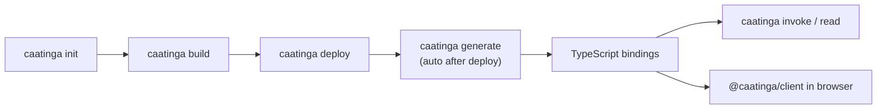

# Caatinga — LLM Reference

Caatinga represents Deployment Orchestration + Versioned Artifacts for Soroban. It provides local, graph-aware deployment orchestration and portable, Git-versioned artifacts (`caatinga.artifacts.json`) for TypeScript teams. It orchestrates scaffold → build → deploy → binding generation → invoke/read without requiring a mandatory on-chain registry. Build/deploy/invoke shell out to Stellar CLI; `caatinga generate` runs `npx @stellar/stellar-sdk generate`.

Equivalent content available at [`/llms-full.txt`](../llms-full.txt). Human docs: [dione-b.github.io/caatinga](https://dione-b.github.io/caatinga/).

## Install & release

| Item              | Value                                                                                                   |
| ----------------- | ------------------------------------------------------------------------------------------------------- |
| npm dist-tag      | `latest` and `next` → **3.7.0** (`@caatinga/cli`, `@caatinga/core`, `@caatinga/client`, `@caatinga/zk`) |
| Status            | Alpha (pre-1.0). The `3.x` major does **not** imply API stability.                                      |
| Global install    | `npm install -g @caatinga/cli`                                                                          |
| No global install | `npx caatinga <command>`                                                                                |
| Reproducible CI   | Pin an exact version (e.g. `@caatinga/cli@3.7.0`), not a floating tag                                   |
| Fresh machine     | Node 22+, then `npx caatinga setup` (Rust, `wasm32v1-none`, Stellar CLI, funded identity)               |
| Stellar CLI       | Hard floor **23.0.0**; last tested **27.0.0**; newer = advisory warning only                            |

## Capability limits

| Capability                      | Status                                                       |
| ------------------------------- | ------------------------------------------------------------ |
| Official frontend templates     | Vite + React only (`vite-react`)                             |
| `caatinga zk build`             | Single-party **dev** ceremony; blocked on mainnet by default |
| `caatinga zk invoke --embed-vk` | Not supported (experimental)                                 |
| Browser `invoke` via wallet     | **Single-invoker only** until v1.0                           |
| Multi-signer / `signAuthEntry`  | Application code → `CAATINGA_MULTI_AUTH_REQUIRED`            |
| Production ZK (MPC ceremony)    | Out of scope                                                 |

---

## 1. Core Workflow



**Minimal loop:**

```bash
npx caatinga init my-dapp && cd my-dapp && npm install
npx caatinga doctor --network testnet --source alice   # verify env
npx caatinga build counter                              # compile WASM
npx caatinga deploy counter --network testnet --source alice  # deploy + auto-generate bindings
npx caatinga invoke counter.increment --network testnet --source alice
npx caatinga read counter.get --network testnet         # read-only, no signing
npx caatinga status --network testnet                   # deployed? bindings fresh?
```

**One-step env setup on a fresh machine:**

```bash
npx caatinga setup  # installs Rust + wasm32v1-none + Stellar CLI, funds `alice` on testnet
```

**Multi-contract graph deploy (with postDeploy hooks and frontend env sync):**

```bash
npx caatinga deploy --network testnet --source alice    # deploy all, wire, sync-env
```

**Contract upgrade (3.7.0) — choose strategy by contract design:**

| Strategy     | Command                     | On-chain effect                        | `contractId`  |
| ------------ | --------------------------- | -------------------------------------- | ------------- |
| **In-place** | `caatinga upgrade`          | Replaces WASM on the existing instance | **Preserved** |
| **Redeploy** | `caatinga deploy --upgrade` | Deploys a new instance                 | **New ID**    |

```bash
# In-place: admin-gated upgrade(new_wasm_hash) entrypoint (stellar-album style)
npx caatinga upgrade counter --network testnet --source alice
npx caatinga upgrade counter --if-changed --source alice --network testnet   # skip when WASM unchanged
npx caatinga upgrade counter --source alice --generate --sync-env            # optional post-steps

# Redeploy: no in-place upgrade entrypoint, or intentional new instance
npx caatinga build counter
npx caatinga deploy counter --upgrade --network testnet --source alice
```

In-place upgrade requires a deployed artifact, admin `--source`, and a contract exposing `upgrade(new_wasm_hash)`. `--generate` / `--sync-env` on upgrade are opt-in (unlike full deploy). In-place WASM rollback via `caatinga rollback` is not supported yet.

---

## 2. Package Reference

| Package                                | Role                                                                  | Browser-safe         | Install command                |
| -------------------------------------- | --------------------------------------------------------------------- | -------------------- | ------------------------------ |
| `@caatinga/cli`                        | CLI binary (`caatinga` command)                                       | No                   | `npm install -g @caatinga/cli` |
| `@caatinga/core`                       | Config loading, artifact I/O, Stellar CLI orchestration, shell layer  | No (use `./browser`) | — (dep of cli)                 |
| `@caatinga/core/browser`               | Errors + artifact types only; excludes Node-only modules              | Yes                  | — (dep of client)              |
| `@caatinga/client`                     | `createCaatingaClient`, wallet session, invoke/read/simulate/buildXdr | Yes                  | `npm install @caatinga/client` |
| `@caatinga/client/react`               | `WalletProvider` + `useWallet` (React >=18 optional peer)             | Yes                  | (subpath of client)            |
| `@caatinga/client/vite`                | SWK bundler helpers: `walletStubViteAliases`, `walletStubOverrides`   | Yes                  | (subpath of client)            |
| `@caatinga/client/freighter`           | Freighter wallet adapter                                              | Yes                  | (subpath of client)            |
| `@caatinga/client/stellar-wallets-kit` | Multi-wallet adapter (Freighter, xBull, etc.)                         | Yes                  | (subpath of client)            |
| `@caatinga/zk`                         | ZK proof serialization, Circom Groth16 helpers                        | No (use `./browser`) | — (dep of cli)                 |
| `@caatinga/zk/browser`                 | Browser ZK binding helpers                                            | Yes                  | (subpath of zk)                |

---

## 3. CLI Command Reference

### Setup & Scaffold

| Command                  | Purpose                                                          | Flags                                                                       |
| ------------------------ | ---------------------------------------------------------------- | --------------------------------------------------------------------------- |
| `caatinga setup`         | Install prerequisites (Rust, wasm target, Stellar CLI, identity) | `--source`, `--network`, `--skip-rust`, `--skip-stellar`, `--skip-identity` |
| `caatinga init <dir>`    | Scaffold project from template (default: react-vite-counter)     | `-t`, `--minimal`, `--empty`                                                |
| `caatinga zk init [dir]` | Scaffold ZK project (zk-starter)                                 | `--minimal`                                                                 |

### Build & Deploy

| Command                        | Purpose                                                                  | Flags                                                                                                                                                                                    |
| ------------------------------ | ------------------------------------------------------------------------ | ---------------------------------------------------------------------------------------------------------------------------------------------------------------------------------------- |
| `caatinga build [contract]`    | Compile WASM with `stellar contract build`. Omit name = build all        | —                                                                                                                                                                                        |
| `caatinga deploy [contract]`   | Deploy, record artifacts, auto-generate bindings. Omit name = full graph | `--network`, `--source`, `--force`, `--upgrade`, `--if-changed`, `--no-deps`, `--verify-deps`, `--no-stale-check`, `--no-generate`, `--no-wire`, `--no-sync-env`, `--allow-dev-ceremony` |
| `caatinga upgrade <contract>`  | In-place WASM upgrade (upload + invoke `upgrade` on existing ID)         | `--network`, `--source`, `--if-changed`, `--expected-hash`, `--no-build`, `--generate`, `--sync-env`                                                                                     |
| `caatinga wire`                | Run `postDeploy` + `postDeployRead` hooks after deploy                   | `--network`, `--source`                                                                                                                                                                  |
| `caatinga sync-env`            | Write `frontend.envFile` from artifacts                                  | `--network`                                                                                                                                                                              |
| `caatinga generate [contract]` | (Re)generate TypeScript bindings. Omit name = all deployed               | `--network`, `--strict-network`                                                                                                                                                          |
| `caatinga smoke`               | Run configured read-only smoke checks with expect DSL                    | `--network`, `--source`                                                                                                                                                                  |
| `caatinga regression`          | Recipe: test → build → deploy --if-changed → generate → smoke            | `--network`, `--source`, `--skip-*`                                                                                                                                                      |
| `caatinga ci run`              | CI helper: doctor → smoke                                                | `--network`, `--source`, `--strict`, `--skip-smoke`                                                                                                                                      |
| `caatinga identity export`     | Export Stellar CLI config as base64 tarball on stdout                    | `--path`                                                                                                                                                                                 |
| `caatinga identity import`     | Import base64 tarball file into Stellar CLI config                       | `[archive-file]`, `--path`                                                                                                                                                               |

### Diagnostics & Status

| Command           | Purpose                                                             | Flags                                                                                      |
| ----------------- | ------------------------------------------------------------------- | ------------------------------------------------------------------------------------------ |
| `caatinga doctor` | Check Node, Stellar CLI, Rust, config, artifacts, network, identity | `--network`, `--source`, `--all-networks`, `--strict`, `--strict-env`, `--strict-bindings` |
| `caatinga status` | Table of deployed contracts + binding freshness per network         | `--network`, `--json`, `--strict`                                                          |

### Invocation

| Command                             | Purpose                                | Flags                                                                         |
| ----------------------------------- | -------------------------------------- | ----------------------------------------------------------------------------- |
| `caatinga invoke <contract.method>` | Sign + submit a state-changing call    | `--network`, `--source`, `[args...]` (aliases in named args resolved to `G…`) |
| `caatinga read <contract.method>`   | Simulate a read-only call (no signing) | `--network`, `--source`, `--expect`, `--quiet`, `--summary`, `[args...]`      |

### Artifacts & diagnostics (advanced)

| Command                               | Purpose                                            | Flags                   |
| ------------------------------------- | -------------------------------------------------- | ----------------------- |
| `caatinga estimate deploy <contract>` | Pre-deploy fee advisory (does not submit)          | `--network`, `--source` |
| `caatinga inspect <contract>`         | Compare local artifacts vs on-chain reachability   | `--network`             |
| `caatinga migrate artifacts`          | Upgrade `caatinga.artifacts.json` to schema v2     | —                       |
| `caatinga rollback <contract>`        | Restore a prior contract ID in artifacts (logical) | `--network`             |

`caatinga deploy --dry-run` is an alias for `caatinga estimate deploy`.

### ZK Commands

| Command                        | Purpose                               | Flags                       |
| ------------------------------ | ------------------------------------- | --------------------------- |
| `caatinga zk build [circuit]`  | Compile Circom + dev trusted setup    | `--embed-vk` (experimental) |
| `caatinga zk prove [circuit]`  | Generate `proof.json` + `public.json` | —                           |
| `caatinga zk invoke [circuit]` | Call on-chain `verify_proof`          | `--source`, `--network`     |

Shared ZK flags: `--allow-dev-ceremony` (bypass mainnet guardrails), `--embed-vk`.

### Important Rules

- `--source` must be a **local Stellar CLI identity alias** (e.g. `alice`), never a `G...` address, secret key (`S...`), or seed phrase.
- `caatinga deploy` auto-generates bindings unless `--no-generate` is passed.
- Full graph deploy (no contract name) auto-runs `wire` + `sync-env` unless `--no-wire` / `--no-sync-env` is passed.
- Transient testnet failures are retried with exponential backoff.
- `caatinga doctor` checks deploy coverage (which contracts are deployed) but **never blocks on it**, even with `--strict`. `--strict` = `--strict-env` + `--strict-bindings` only.
- `deploy --if-changed` skips unchanged WASM with `[skipped] unchanged`.
- `caatinga upgrade` replaces WASM **in-place** (same `contractId`); `deploy --upgrade` redeploys to a **new** instance with history.
- `upgrade --if-changed` skips when local WASM hash matches the artifact (no upload/invoke).
- `status --strict` exits with code `1` when any **deployed** contract has bindings other than `fresh` (canonical check after `deploy --no-generate`).
- `ci run --strict` forwards to `doctor` only (`--strict-env` + `--strict-bindings`); it does **not** run `status --strict`.
- Expect DSL — shared by `postDeploy`, `postDeployRead`, `smoke.reads`, `caatinga smoke`, and `read --expect`:

| Form                                            | Example                         | Meaning                                         |
| ----------------------------------------------- | ------------------------------- | ----------------------------------------------- |
| Plain string                                    | `"42"` or `"${source.address}"` | Exact stdout match after placeholder resolution |
| `{ matcher: "reachable" }`                      | default in smoke when omitted   | Non-empty stdout                                |
| `{ matcher: "equals", value: "42" }`            | numeric/string equality         | Same as plain string                            |
| `{ matcher: "isArray" }`                        | list payloads                   | Parsed JSON is an array                         |
| `{ matcher: "isNull" }`                         | optional fields                 | stdout is `null` or empty                       |
| `{ matcher: "minLength", value: 1 }`            | array checks                    | Parsed JSON array length ≥ value                |
| `{ matcher: "maxLength", value: 10 }`           | bounded lists                   | Parsed JSON array length ≤ value                |
| `{ matcher: "contains", value: "abc" }`         | substring                       | stdout includes value                           |
| `{ matcher: "matches", value: "^C[A-Z0-9]+$" }` | regex                           | stdout matches pattern                          |
| `{ matcher: "jsonEquals", value: "[1,2]" }`       | deep JSON                       | Parsed JSON deep-equals value                   |

---

## 4. Config Schema (`caatinga.config.ts`)

```ts
import { defineConfig } from "@caatinga/core";

export default defineConfig({
  project: "my-dapp", // required, string min 1
  defaultNetwork: "testnet", // optional, default "testnet"

  contracts: {
    counter: {
      path: "./contracts/counter", // required: contract source dir
      wasm: "./contracts/counter/target/wasm32v1-none/release/counter.wasm", // required: compiled WASM
      buildFeatures: ["--no-default-features", "--features", "testnet"], // optional: Cargo features
      dependsOn: ["token"], // optional: contracts deployed first
      deployArgs: {
        // optional: constructor args; supports placeholders
        tokenContractId: "${contracts.token.contractId}",
      },
    },
  },

  buildRoot: "./contracts", // optional: Cargo workspace root for single stellar contract build

  networks: {
    testnet: {
      rpcUrl: "https://soroban-testnet.stellar.org", // required
      networkPassphrase: "Test SDF Network ; September 2015", // required
    },
  },

  frontend: {
    framework: "vite-react", // optional, default "vite-react"
    bindingsOutput: "./src/contracts/generated", // required if frontend is set
    envFile: "./frontend/.env.local", // optional: written by sync-env
    env: {
      // optional: maps to env var names
      counter: "VITE_COUNTER_ID",
      "counter.wasmHash": "VITE_COUNTER_WASM_HASH", // .wasmHash suffix
      rpcUrl: "VITE_RPC_URL",
      networkPassphrase: "VITE_NETWORK_PASSPHRASE",
    },
  },

  postDeploy: [
    // optional: admin-signed invokes after full deploy
    {
      contract: "counter",
      method: "initialize",
      args: { owner: "${source.address}" },
      kind: "invoke", // default
      expect: { matcher: "reachable" },
    },
  ],

  postDeployRead: [
    // optional: simulate-only hooks (same shape as postDeploy)
    { contract: "counter", method: "count", kind: "read", expect: { matcher: "reachable" } },
  ],

  smoke: {
    useFreshSymbol: false, // inject ephemeral symbol arg when true
    reads: [{ contract: "counter", method: "count", expect: { matcher: "reachable" } }],
  },

  zk: {
    // optional: ZK circuit configuration
    circuits: {
      main: {
        path: "./circuits/main",
        protocol: "groth16",
        curve: "bls12381",
        verifierContract: "verifier",
      },
    },
  },
});
```

### Deploy args placeholder resolution

| Placeholder                      | Resolved to                                                    | Example                         |
| -------------------------------- | -------------------------------------------------------------- | ------------------------------- |
| `${contracts.<name>.contractId}` | Deployed contract ID from `caatinga.artifacts.json`            | `${contracts.token.contractId}` |
| `${source.address}`              | Stellar CLI identity address (`stellar keys address <source>`) | `${source.address}`             |

**Config load-time graph validation (3.7.0):** `loadConfig` fails fast before any command runs:

- `dependsOn` entries must name configured contracts → `CAATINGA_CONTRACT_DEPENDENCY_NOT_FOUND`
- Dependency cycles are rejected → `CAATINGA_CONTRACT_DEPENDENCY_CYCLE`
- Every `${contracts.<name>.contractId}` in `deployArgs` must have `<name>` in `dependsOn` → `CAATINGA_INVALID_CONFIG`

**Deploy-time resolution** happens after dependencies deploy:

- Missing artifact for a dependency → `CAATINGA_CONTRACT_DEPENDENCY_ARTIFACT_NOT_FOUND`
- Placeholder still unresolved at deploy → `CAATINGA_DEPLOY_ARG_PLACEHOLDER_UNRESOLVED`
- Malformed `${...}` syntax → `CAATINGA_DEPLOY_ARG_PLACEHOLDER_INVALID`

Deploy arg keys are converted camelCase → snake_case CLI flags (e.g. `tokenContractId` → `--token_contract_id`).

---

## 5. Artifacts Schema (`caatinga.artifacts.json`)

```json
{
  "project": "my-dapp",
  "version": 2,
  "networks": {
    "testnet": {
      "contracts": {
        "counter": {
          "contractId": "C...",
          "wasmHash": "...",
          "deployedAt": "2026-01-01T00:00:00.000Z",
          "sourcePath": "./contracts/counter",
          "wasmPath": "./contracts/counter/target/wasm32v1-none/release/counter.wasm",
          "dependencies": [],
          "resolvedDeployArgs": {}
        }
      },
      "dependencyGraph": {}
    }
  }
}
```

### ContractArtifact fields

| Field                | Type     | Required         | Notes                                      |
| -------------------- | -------- | ---------------- | ------------------------------------------ |
| `contractId`         | string   | yes              | On-chain deployed ID                       |
| `wasmHash`           | string   | yes              | Hash of deployed WASM                      |
| `deployedAt`         | ISO 8601 | yes              |                                            |
| `sourcePath`         | string   | yes              |                                            |
| `wasmPath`           | string   | yes              |                                            |
| `dependencies`       | string[] | no, default `[]` | Resolved dependency contract names         |
| `resolvedDeployArgs` | object   | no, default `{}` | Deploy args after placeholder resolution   |
| `upgradeStrategy`    | string   | no               | `"in-place"` or `"redeploy"`               |
| `history`            | array    | no               | Prior versions (schema v2); see config doc |

History entries include `contractId`, `wasmHash`, `deployedAt`, `supersededAt`, optional `reason`, and optional `upgradeType` (`"in-place"` \| `"new-contract"`).

Schema **v2** is current. v1 files are auto-readable. Run `caatinga migrate artifacts` to bump version without redeploying.

---

## 6. Client API (`@caatinga/client`)

### createCaatingaClient

```ts
import { createCaatingaClient } from "@caatinga/client";
import * as Counter from "./contracts/generated/counter";
import artifacts from "../caatinga.artifacts.json";

const client = createCaatingaClient({
  network: {
    name: "testnet",
    rpcUrl: "https://soroban-testnet.stellar.org",
    networkPassphrase: "Test SDF Network ; September 2015",
  },
  artifacts,
  wallet: myWalletAdapter, // CaatingaWalletAdapter
  contracts: {
    counter: {
      binding: Counter, // generated binding (must export `Client`)
      contractId: "C...", // optional: override artifacts lookup
    },
  },
  walletTimeout: 30_000, // optional: ms timeout for wallet calls
});
```

### Contract methods

```ts
// Read-only — returns parsed value directly
const value = await client.contract("counter").read<number>("get");

// Simulate — returns full result with metadata
const sim = await client.contract("counter").simulate<number>("get", { debugRaw: true });

// State-changing — signs and submits
const result = await client.contract("counter").invoke<number>("increment");
// result = { status, contract, method, contractId, transactionHash, result? }

// With args
await client.contract("token").invoke("transfer", { to: addr, amount: 100n });

// Build XDR only (no sign, no submit)
const tx = await client.contract("counter").buildXdr("increment");
// tx = { unsignedXdr, preparedXdr }

// Debug XDR
const result = await client.contract("counter").invoke("increment", {
  debugXdr: true, // includes xdr.unsigned, xdr.prepared, xdr.signed
  debugRaw: true, // includes raw binding output
});
```

### Read vs Simulate vs Invoke

| API          | Signs? | Submits? | Returns                                                        |
| ------------ | ------ | -------- | -------------------------------------------------------------- |
| `read()`     | No     | No       | Parsed value directly                                          |
| `simulate()` | No     | No       | `{ status, contractId, result, raw? }`                         |
| `invoke()`   | Yes    | Yes      | `{ status, contractId, transactionHash, result?, xdr?, raw? }` |

### Wallet adapter interface

```ts
interface CaatingaWalletAdapter {
  getPublicKey(): Promise<string>;
  signTransaction(input: { xdr: string; networkPassphrase: string }): Promise<string>;
}
```

Rules:

- **Must reject on user dismissal** (never leave promise pending).
- Caatinga imposes no default timeout. Pass `walletTimeout` on config.

### Wallet session (framework-agnostic)

```ts
import { createWalletSession } from "@caatinga/client";

const session = createWalletSession(adapter, { persist: true });
session.subscribe(() => render(session.getState()));
await session.connect(); // modal when available, else getPublicKey
await session.restore(); // silent reconnect on page load — never rejects
await session.disconnect();
```

### React hooks

```tsx
import { WalletProvider, useWallet } from "@caatinga/client/react";

<WalletProvider adapter={wallet} options={{ persist: true }}>
  <App />
</WalletProvider>;

function App() {
  const { publicKey, connected, connecting, error, connect, disconnect } = useWallet();
  // ...
}
```

---

## 7. Error Codes

All errors use `CAATINGA_*` codes. **Automation must key on the code, never on message text.**

### Common CLI errors

| Code                               | Trigger                                 |
| ---------------------------------- | --------------------------------------- |
| `CAATINGA_CONFIG_NOT_FOUND`        | `caatinga.config.ts` not found          |
| `CAATINGA_INVALID_CONFIG`          | Config failed validation                |
| `CAATINGA_STELLAR_CLI_NOT_FOUND`   | `stellar` binary not in PATH            |
| `CAATINGA_BUILD_FAILED`            | Contract build failed (Cargo error)     |
| `CAATINGA_DEPLOY_FAILED`           | Deploy failed (Stellar CLI error)       |
| `CAATINGA_UPLOAD_FAILED`           | WASM upload failed (`caatinga upgrade`) |
| `CAATINGA_WASM_HASH_NOT_FOUND`     | Upload output missing WASM hash         |
| `CAATINGA_BINDINGS_FAILED`         | Binding generation failed               |
| `CAATINGA_INVOKE_FAILED`           | Contract invoke failed                  |
| `CAATINGA_CONTRACT_NOT_FOUND`      | Unknown contract name in config         |
| `CAATINGA_NETWORK_NOT_FOUND`       | Unknown `--network` value               |
| `CAATINGA_ARTIFACT_NOT_FOUND`      | Missing artifacts file or record        |
| `CAATINGA_SOURCE_ACCOUNT_REQUIRED` | `--source` omitted                      |
| `CAATINGA_SOURCE_IS_SECRET_KEY`    | `S...` passed as `--source`             |
| `CAATINGA_SOURCE_IS_SEED_PHRASE`   | Seed phrase passed as `--source`        |
| `CAATINGA_SOURCE_IS_PUBLIC_KEY`    | `G...` address passed as `--source`     |
| `CAATINGA_INVOKE_TARGET_INVALID`   | Target not in `contract.method` format  |
| `CAATINGA_UNSUPPORTED_CLI_VERSION` | Stellar CLI below hard floor (23.0.0)   |

### Multi-contract / dependency errors

| Code                                              | Trigger                                                    |
| ------------------------------------------------- | ---------------------------------------------------------- |
| `CAATINGA_CONTRACT_DEPENDENCY_NOT_FOUND`          | `dependsOn` references unknown contract                    |
| `CAATINGA_CONTRACT_DEPENDENCY_CYCLE`              | Circular dependency detected                               |
| `CAATINGA_CONTRACT_DEPENDENCY_ARTIFACT_NOT_FOUND` | Dependency not deployed yet                                |
| `CAATINGA_DEPLOY_ARG_PLACEHOLDER_INVALID`         | Malformed `${...}` placeholder                             |
| `CAATINGA_DEPLOY_ARG_PLACEHOLDER_UNRESOLVED`      | Placeholder not resolved at deploy time                    |
| `CAATINGA_SOURCE_ADDRESS_UNRESOLVED`              | `${source.address}` used without `--source`                |
| `CAATINGA_POST_DEPLOY_VERIFY_FAILED`              | `expect` mismatch in postDeploy, smoke, or `read --expect` |
| `CAATINGA_ADDRESS_ALIAS_UNRESOLVED`               | CLI alias in method arg could not be resolved              |
| `CAATINGA_NETWORK_ARTIFACTS_MISSING`              | `generate --strict-network` with no artifacts for network  |

### Client errors

| Code                                   | Trigger                                          |
| -------------------------------------- | ------------------------------------------------ |
| `CAATINGA_CONTRACT_ARTIFACT_NOT_FOUND` | Contract not deployed on selected network        |
| `CAATINGA_BINDING_CLIENT_NOT_FOUND`    | Generated binding missing `Client` export        |
| `CAATINGA_BINDING_METHOD_NOT_FOUND`    | Method not found in binding                      |
| `CAATINGA_PLACEHOLDER_BINDING`         | Still using scaffold placeholder; run `generate` |
| `CAATINGA_WALLET_NOT_CONNECTED`        | `getPublicKey()` rejected                        |
| `CAATINGA_WALLET_TIMEOUT`              | Wallet call exceeded `walletTimeout`             |
| `CAATINGA_XDR_BUILD_FAILED`            | Could not build transaction XDR                  |
| `CAATINGA_XDR_SIGN_FAILED`             | Wallet rejected signing                          |
| `CAATINGA_XDR_SUBMIT_FAILED`           | RPC rejected submission                          |
| `CAATINGA_READ_RESULT_MISSING`         | Simulated read returned no result                |
| `CAATINGA_MULTI_AUTH_REQUIRED`         | Multi-signer needed; not supported until v1.0    |

### ZK errors

| Code                               | Trigger                                                          |
| ---------------------------------- | ---------------------------------------------------------------- |
| `CAATINGA_ZK_VERIFICATION_FAILED`  | On-chain verify_proof returned false                             |
| `CAATINGA_ZK_DEV_CEREMONY_BLOCKED` | Dev ceremony artifacts on mainnet without `--allow-dev-ceremony` |

### Stellar CLI warnings (advisory, non-fatal)

| Code                           | Meaning                            |
| ------------------------------ | ---------------------------------- |
| `STELLAR_CLI_UNTESTED_VERSION` | CLI newer than last-tested version |
| `STELLAR_CLI_MISSING_FEATURE`  | Required feature not advertised    |

---

## 8. Key Gotchas & Rules

1. **`--source` must be a CLI identity alias** — never a `G...`, `S...`, or seed phrase.
2. **Deploy auto-generates bindings** — pass `--no-generate` to skip in CI.
3. **Full graph deploy auto-runs `wire` + `sync-env`** — pass `--no-wire` / `--no-sync-env` to skip.
4. **Browser invoke is single-invoker only until v1.0** — multi-signer (`signAuthEntry`) is application code and throws `CAATINGA_MULTI_AUTH_REQUIRED`.
5. **ZK on mainnet is blocked by default** — dev ceremony artifacts require `--allow-dev-ceremony` (not for production).
6. **Fresh machine** — Install Node 22+, `caatinga setup` does the rest.
7. **Errors are public API** — automation must parse `CAATINGA_*` codes, not message text.
8. **`read()` vs `invoke()`** — `read` = simulate (no sign), `invoke` = sign + submit.
9. **Wallet adapters must reject on dismissal** — never leave promise pending.
10. **`caatinga.artifacts.json` is git-versioned** — the artifacts file stays in your repo even if you stop using Caatinga.
11. **Binding freshness** is tracked by `.caatinga-bindings.json` marker. States: `fresh`, `stale`, `missing`, `unknown`.
12. **`caatinga doctor` deploy coverage is advisory** — never blocks exit code.
13. **Stellar CLI compatibility** — hard floor 23.0.0, last tested 27.0.0. Newer versions produce advisory warnings only.
14. **`buildRoot`** — when set, a single `stellar contract build` runs from the Cargo workspace root instead of per-contract builds.
15. **`buildFeatures`** — passed directly to `stellar contract build` as CLI args. Combine with `--no-default-features` to override defaults. Warning when used with `buildRoot`.
16. **`postDeploy` source override** — per-hook `source` is validated via `assertSafeSourceAccount` (rejects `S...`, `G...`, seed phrases).
17. **`postDeploy` expect** — stdout verified with string equality or structural matchers. Use `postDeployRead` or `kind: "read"` for simulate-only hooks. Also applies to `caatinga smoke` and `read --expect`.
18. **`frontend.env` suffixes** — env map keys support `.contractId` (default), `.wasmHash`, `.deployedAt`, `.wasmPath` suffixes for artifact field sync.
19. **`doctor --strict`** — blocks on env drift (`--strict-env`) and stale bindings (`--strict-bindings`) only; deploy coverage and WASM drift stay advisory.
20. **`caatinga regression`** — local recipe mirroring CI: test → build → deploy --if-changed → generate → smoke.
21. **Alias resolution** — method args may use `${source.address}` or CLI aliases (≥3 chars); prefer placeholders in config.
22. **`identity export/import`** — base64 tarball for `CAATINGA_CI_STELLAR_CONFIG_B64`; import reads a base64 text file path.
23. **Config graph validation (3.7.0)** — `${contracts.*.contractId}` placeholders in `deployArgs` must be listed in `dependsOn`; validated at config load, not only at deploy.
24. **`caatinga upgrade` vs `deploy --upgrade`** — in-place preserves `contractId` and records WASM history; redeploy creates a new instance with `upgradeType: "new-contract"` history.
25. **`read --summary` / `--quiet`** — compact output for large array payloads on shared testnet state.

---

## 9. Templates

| Template                       | Command                  | Description                                    |
| ------------------------------ | ------------------------ | ---------------------------------------------- |
| `react-vite-counter` (default) | `caatinga init <dir>`    | Vite + React + counter contract + wallet stubs |
| `zk-starter`                   | `caatinga zk init <dir>` | Circom multiplier circuit + Groth16 verifier   |

Minimal scaffolds (CLI-only, no frontend):

```bash
caatinga init <dir> --minimal     # Soroban contract stub
caatinga zk init <dir> --minimal  # ZK-only with empty starter circuit
```

---

## 10. Binding Freshness

| State     | Meaning                                           | Fix                                        |
| --------- | ------------------------------------------------- | ------------------------------------------ |
| `fresh`   | Bindings match deployed `contractId` + `wasmHash` | —                                          |
| `stale`   | Contract redeployed since last generate           | `caatinga generate <name> --network <net>` |
| `missing` | No bindings on disk                               | `caatinga generate`                        |
| `unknown` | Bindings exist but predate freshness tracking     | Regenerate once                            |

Freshness tracked via `.caatinga-bindings.json` marker next to each generated binding package.

---

## 11. Project File Layout

```
my-dapp/
├── caatinga.config.ts           # Config: contracts, networks, frontend
├── caatinga.artifacts.json      # Deployed contract IDs per network
├── contracts/
│   └── counter/                 # Soroban Rust contract
│       ├── Cargo.toml
│       └── src/lib.rs
├── src/
│   ├── contracts/generated/     # TypeScript bindings (auto-generated)
│   │   └── counter/
│   │       ├── src/index.ts
│   │       └── .caatinga-bindings.json  # freshness marker
│   ├── caatinga.ts              # Client wiring (static imports)
│   └── App.tsx
└── package.json
```

---

## 12. Agent guidance

### Working on a Caatinga **project** (generated app)

1. Run `caatinga doctor --network testnet --source alice` before changing deploy state.
2. Order: `build` → `deploy` (or `upgrade` for in-place WASM) → (`generate` if `--no-generate`) → `invoke` / browser client.
3. Parse **`CAATINGA_*` error codes**, never message text.
4. `--source` = Stellar CLI identity alias only (`alice`), never `G...` / `S...` / seed phrase.
5. Browser wallet flows: single-invoker until v1.0.

Optional [stellar-build](https://github.com/kaankacar/stellar-build) agents drive Caatinga commands from Claude Code or Codex — see [Integration guide](./tutorials/integration-guide.md).

### Working on the **Caatinga monorepo**

| Doc                                   | Use when                                                                |
| ------------------------------------- | ----------------------------------------------------------------------- |
| [AGENTS.md](../AGENTS.md)             | Repo layout, build/test commands, version alignment, template overrides |
| [CONTRIBUTING.md](../CONTRIBUTING.md) | PR expectations, commit style, compatibility contracts                  |
| [Architecture](./architecture.md)     | Product stance, Caatinga vs Scaffold Stellar                            |
| [Errors](./errors.md)                 | Full `CAATINGA_*` catalog with fixes                                    |
| [CLI](./cli.md)                       | Authoritative command reference                                         |
| [Config](./config.md)                 | `caatinga.config.ts` schema details                                     |
| [Contract upgrade](./tutorials/contract-upgrade.md) | In-place vs redeploy upgrade strategies (3.7.0)              |

Monorepo dev: `pnpm install --frozen-lockfile`, `pnpm build`, `pnpm test`, `pnpm dev <cli-args>`.

### Public contracts (do not break without migration note)

- `caatinga.artifacts.json` schema
- `caatinga.config.ts` shape
- `CaatingaErrorCode` values
- Documented CLI commands, flags, and package `exports`
