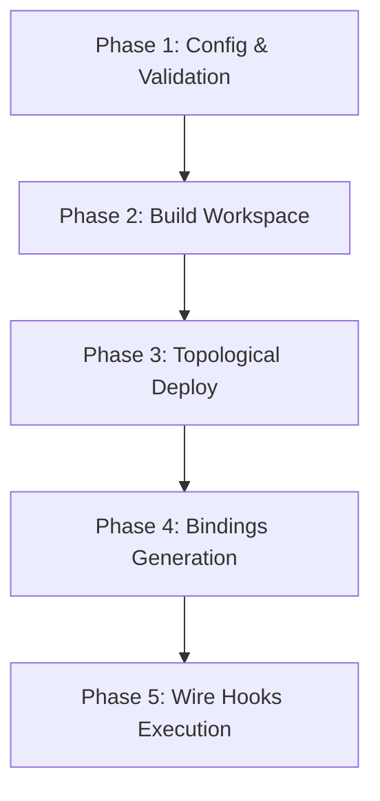

# Lifecycle & Post-Deploy Hooks Specification

This document details the execution phases of the Caatinga orchestrator pipeline and specifies the behavior and assertions of post-deploy hooks.

---

## 1. Orchestrator Lifecycle Phases

Caatinga operates as a deterministic, phase-based pipeline. When a developer runs `ctg deploy` or similar orchestration commands, the execution proceeds sequentially through five distinct phases:



### Phase 1: Config & Validation

- **Actions:** Loads `caatinga.config.ts`, resolves the target network connection parameters, and validates the multi-contract dependency graph (detecting cycles or missing dependency declarations).

### Phase 2: Build Workspace (Optional)

- **Actions:** Compiles all target contract WASM binaries using `cargo build --target wasm32-unknown-unknown`. This phase can be skipped by passing `--no-build`.

### Phase 3: Topological Deploy

- **Actions:** Deploys contracts in topological dependency order (non-linear).
  - Evaluates `--if-changed` cache: skips deploy if WASM hash matches `caatinga.artifacts.json`.
  - Performs network deploy and updates contract addresses.
  - Dynamically resolves placeholders (`${contracts.<name>.contractId}`) for downstream contracts.

### Phase 4: Bindings Generation (Optional)

- **Actions:** Generates TypeScript clients and wallet bindings using the current `caatinga.artifacts.json` as the input. Writes freshness markers (`.caatinga-bindings.json`) to the frontend folders.

### Phase 5: Wire Hooks Execution

- **Actions:** Executes sequential post-deploy hooks (`postDeploy` and `postDeployRead`) to wire contract dependencies, initialize storage, or verify state.

---

## 2. Post-Deploy Hooks Specification

Hooks are declared globally in `caatinga.config.ts` and run during the `ctg wire` command (or automatically at the end of `ctg deploy`).

### Hook Types

1. **Invoke Hooks (`postDeploy`):**
   - **Purpose:** Executes transaction-submitting contract calls (write operations).
   - **Behavior:** Invokes the contract method on-chain, signing the transaction using the designated `--source` identity.
2. **Read Hooks (`postDeployRead`):**
   - **Purpose:** Executes simulated read-only contract calls (view operations).
   - **Behavior:** Queries the ledger state without submitting transactions, returning the serialized simulation response.

### Arguments & Placeholder Resolution

All arguments passed to hooks (`args`) are evaluated by the **Placeholder Engine**. Hooks can accept:

- Static primitives (`string`, `number`, `boolean`).
- Dynamic contract address lookups: `${contracts.<contractName>.contractId}`.
- Active deployer address: `${source.address}`.

### Assertion Engine (`expect`)

To ensure the pipeline succeeded, hooks can define an `expect` assertion to validate the method output:

- **Simple Assertion:**
  ```ts
  expect: "expected_return_value";
  ```
- **Type-Safe Assertion:**
  ```ts
  expect: {
    value: "${contracts.token.contractId}",
    type: "address" // validates return type matches address format
  }
  ```
- If the method return value does not match the assertion, the pipeline immediately halts with a `CAATINGA_POST_DEPLOY_VERIFY_FAILED` error.
