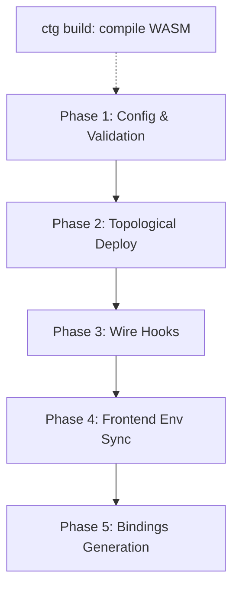

# Lifecycle & Post-Deploy Hooks Specification

This document details the execution phases of the Caatinga orchestrator pipeline and specifies the behavior and assertions of post-deploy hooks.

---

## 1. Orchestrator Lifecycle Phases

Caatinga operates as a deterministic, phase-based pipeline. `ctg build` compiles WASM; `ctg deploy`
then runs the phases below. Phases 3–5 run automatically only on a **full-graph deploy**
(`ctg deploy` with no contract name); a single-contract deploy (`ctg deploy counter`) still
generates bindings but skips wiring and env sync.


```mermaid
graph TD
  Build[ctg build: compile WASM] -.-> Phase1
  Phase1[Phase 1: Config & Validation] --> Phase2[Phase 2: Topological Deploy]
  Phase2 --> Phase3[Phase 3: Wire Hooks]
  Phase3 --> Phase4[Phase 4: Frontend Env Sync]
  Phase4 --> Phase5[Phase 5: Bindings Generation]
```

### Build (separate command)

- **Actions:** `ctg build [contract]` runs `stellar contract build` (target `wasm32v1-none`). Deploy
  never builds; it hashes the existing WASM and fails with `CAATINGA_ARTIFACT_NOT_FOUND` if it is
  missing. Only `ctg upgrade` builds implicitly (skip with `--no-build`).

### Phase 1: Config & Validation

- **Actions:** Loads `caatinga.config.ts`, resolves the target network connection parameters, and validates the multi-contract dependency graph (detecting cycles or missing dependency declarations).

### Phase 2: Topological Deploy

- **Actions:** Deploys contracts in topological dependency order (non-linear).
  - Skips contracts that already have a `contractId` (with `--if-changed`, skips only when the WASM hash matches; `--force` always redeploys).
  - Performs network deploy and updates contract addresses.
  - Dynamically resolves placeholders (`${contracts.<name>.contractId}`) for downstream contracts.

### Phase 3: Wire Hooks (full deploy only; skip with `--no-wire`)

- **Actions:** Runs `postDeploy` and `postDeployRead` hooks in order when either declares at least
  one hook (before 3.12.0, a `postDeploy` array was required, so
  `postDeployRead`-only configs were skipped). A failure here does not fail the deploy: Caatinga prints the error and the
  `ctg wire` recovery command.

### Phase 4: Frontend Env Sync (full deploy only; skip with `--no-sync-env`)

- **Actions:** Writes `frontend.envFile` from the `frontend.env` mapping (same as `ctg sync-env`).
  Runs only when both `frontend.envFile` and `frontend.env` are configured.

### Phase 5: Bindings Generation (skip with `--no-generate`)

- **Actions:** Generates TypeScript bindings for the contracts deployed in this run and writes freshness markers (`.caatinga-bindings.json`). Generation failure does not fail the deploy; recover with `ctg generate`.

---

## 2. Post-Deploy Hooks Specification

Hooks are declared globally in `caatinga.config.ts` and run during the `ctg wire` command (or automatically after a full-graph `ctg deploy`, see Phase 3).

### Hook Types

Each hook has `kind: "invoke" | "read"` (default `"invoke"`).

1. **Invoke hooks** (`postDeploy` entries with the default `kind`):
   - **Purpose:** Executes transaction-submitting contract calls (write operations).
   - **Behavior:** Invokes the contract method on-chain, signing the transaction using the designated `--source` identity.
2. **Read hooks** (`postDeploy` entries with `kind: "read"`, or any `postDeployRead` entry — always read):
   - **Purpose:** Executes simulated read-only contract calls (view operations).
   - **Behavior:** Queries the ledger state without submitting transactions, returning the serialized simulation response.

### Arguments & Placeholder Resolution

All arguments passed to hooks (`args`) are evaluated by the **Placeholder Engine**. Hooks can accept:

- Static primitives (`string`, `number`, `boolean`).
- Dynamic contract address lookups: `${contracts.<contractName>.contractId}`.
- Active deployer address: `${source.address}`.

### Assertion Engine (`expect`)

To ensure the pipeline succeeded, hooks can define an `expect` assertion to validate the method output:

- **Simple Assertion** (exact stdout match after placeholder resolution, e.g. `"${contracts.token.contractId}"`):
  ```ts
  expect: "expected_return_value";
  ```
- **Matcher Assertion:**
  ```ts
  expect: { matcher: "matches", value: "^C[A-Z2-7]{55}$" }
  ```
  `matcher` is one of `equals`, `reachable`, `isNull`, `isArray`, `minLength`, `maxLength`,
  `contains`, `matches`, `jsonEquals`. See the [Expect DSL](./cli.md#expect-dsl) table.
- If the method return value does not match the assertion, the pipeline immediately halts with a `CAATINGA_POST_DEPLOY_VERIFY_FAILED` error.
