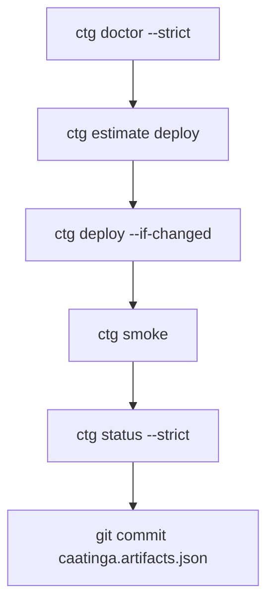

# Production Readiness

Use this checklist before deploying to mainnet or handing a project to a production team. Pin exact package versions in production CI — see [Public API](./public-api.md).

## Pre-flight checklist

Run through each item; `ctg doctor` covers several automatically.

| #   | Check                                               | Command / doc                                                                                                |
| --- | --------------------------------------------------- | ------------------------------------------------------------------------------------------------------------ |
| 1   | Node 22+, Stellar CLI ≥ 23.0.0 (27.0.0 recommended) | `ctg doctor`                                                                                                 |
| 2   | `@stellar/stellar-sdk` within supported range       | `ctg doctor` (SDK diagnostic)                                                                                |
| 3   | Signing identity funded and correct network         | `ctg doctor --source <alias> --network <net>`                                                                |
| 4   | All configured contracts deployed on target network | `ctg status --network <net>`                                                                                 |
| 5   | Bindings fresh (marker matches artifacts)           | `ctg doctor --strict-bindings` / `ctg status --strict`                                                       |
| 5b  | Frontend env matches artifacts                      | `ctg doctor --strict-env` / `ctg sync-env --network <net>`                                                   |
| 5c  | Post-deploy read checks pass                        | `ctg smoke --network <net> --source <alias>`                                                                 |
| 6   | Deploy cost estimated                               | `ctg estimate deploy <contract> --network <net>`                                                             |
| 7   | Artifacts schema migrated (if using history)        | `ctg migrate artifacts`                                                                                      |
| 8   | Signing strategy documented for your team           | [Signing strategy](./signing-strategy.md)                                                                    |
| 9   | Stellar CLI and SDK versions pinned in CI           | [Stellar CLI contract](./stellar-cli-version-contract.md), [SDK contract](./stellar-sdk-version-contract.md) |
| 9b  | CI identity exported and rotated safely             | `ctg identity export` → `CAATINGA_CI_STELLAR_CONFIG_B64` (see [Testing](./internal/testing.md))              |
| 10  | Upgrade/rollback plan understood                    | [Contract upgrade](./tutorials/contract-upgrade.md)                                                          |
| 10b | Deploy regression workflow green on testnet         | `ctg regression` or `.github/workflows/testnet-deploy-regression.yml`                                        |

## What Caatinga provides today

- **Diagnostics:** `ctg doctor` — toolchain, config, artifacts, binding freshness, deploy coverage, env drift, WASM drift advisories, version matrix.
- **Verification:** `ctg smoke`, `ctg read --expect`, `ctg regression` — post-deploy read checks with expect DSL.
- **State inspection:** `ctg status`, `ctg inspect <contract>` — per-network deploy and binding state.
- **Cost estimation:** `ctg estimate deploy` — pre-deploy fee breakdown (advisory).
- **Artifact history (v2):** prior `contractId`s on redeploy (`deploy --upgrade` / `--force`); prior `wasmHash`es on in-place upgrade (`ctg upgrade`).
- **In-place upgrade:** `ctg upgrade <contract>` — upload WASM + invoke admin-gated `upgrade()`; preserves `contractId`. See [Contract upgrade](./tutorials/contract-upgrade.md).
- **Rollback (logical):** `ctg rollback <contract> --to <contractId>` — restore artifact entry after **redeploy** upgrades (on-chain orphan warning applies). In-place WASM rollback is not supported yet.

## What Caatinga does not provide

- Automatic on-chain rollback or contract deletion.
- KMS, hardware wallet, or backend signing integration.
- Multi-environment dimension (staging vs prod on same network) — use git branches or separate projects.
- Hosted registry or deployment dashboard.
- Guaranteed mainnet fee accuracy under congestion.
- **HTTP/REST E2E, database persistence, async job reliability, or per-endpoint caller auth** — see [Architecture — product boundary](./architecture.md#meta-framework-boundary-orchestrate-workflow-not-mental-model).

## App-side checklist (outside `ctg doctor`)

Run these in your application CI; they are not part of the Caatinga pipeline.

| #   | Check                                                            | Notes                                                            |
| --- | ---------------------------------------------------------------- | ---------------------------------------------------------------- |
| A1  | Server invoke persists `tx_hash` (or Soroban hash) in your DB    | Caatinga CLI/client invoke success ≠ REST handler wrote a row    |
| A2  | Async anchor/submit jobs expose failure to operators             | Fire-and-forget jobs fail silently without app-level monitoring  |
| A3  | Each endpoint uses the intended signing identity                 | Org wallet vs server key mismatches are app config, not Caatinga |
| A4  | JWT/session auth on mutating routes                              | Out of scope for `ctg doctor`                                    |
| A5  | Poll or webhook confirms on-chain inclusion before returning 200 | Optional pattern for write APIs                                  |

Template stub: `integration.app-e2e.ts` in `react-vite-counter` (replace with real tests).

## Recommended production workflow

1. Pin Stellar CLI `27.0.0` and `@stellar/stellar-sdk ^16.0.1` in CI and locally.
2. Run `ctg doctor --strict` on every PR that touches contracts.
3. Estimate fees before mainnet deploys.
4. Use `deploy --if-changed` on testnet/staging to skip unchanged WASM.
5. Run `ctg smoke` after deploy on testnet.
6. Commit `caatinga.artifacts.json` after every deploy.
7. Use `ctg deploy --upgrade` (not blind `--force`) when redeploying to a **new contract instance**.
8. Use `ctg upgrade <contract>` when the contract exposes admin-gated in-place `upgrade(new_wasm_hash)` — preserves `contractId` and storage.
9. Document your signing alias and funding source outside the repo.

## Multi-frontend projects

One `caatinga.artifacts.json` per Caatinga project root. Multiple frontends (web, mobile wrapper, admin panel) should import the same artifacts file and generated bindings — do not fork artifacts per app.

## Related docs

- [Signing strategy](./signing-strategy.md)
- [Public API](./public-api.md)
