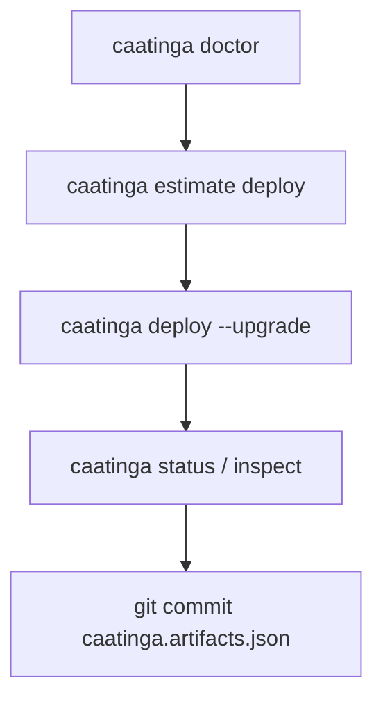

# Production Readiness

Caatinga is **alpha software**. Use this checklist before deploying to mainnet or handing a project to a production team.

## Pre-flight checklist

Run through each item; `caatinga doctor` covers several automatically.

| #   | Check                                               | Command / doc                                                                                                |
| --- | --------------------------------------------------- | ------------------------------------------------------------------------------------------------------------ |
| 1   | Node 22+, Stellar CLI ≥ 23.0.0 (25.2.0 recommended) | `caatinga doctor`                                                                                            |
| 2   | `@stellar/stellar-sdk` within supported range       | `caatinga doctor` (SDK diagnostic)                                                                           |
| 3   | Signing identity funded and correct network         | `caatinga doctor --source <alias> --network <net>`                                                           |
| 4   | All configured contracts deployed on target network | `caatinga status --network <net>`                                                                            |
| 5   | Bindings fresh (marker matches artifacts)           | `caatinga doctor` / `caatinga status`                                                                        |
| 6   | Deploy cost estimated                               | `caatinga estimate deploy <contract> --network <net>`                                                        |
| 7   | Artifacts schema migrated (if using history)        | `caatinga migrate artifacts`                                                                                 |
| 8   | Signing strategy documented for your team           | [Signing strategy](./signing-strategy.md)                                                                    |
| 9   | Stellar CLI and SDK versions pinned in CI           | [Stellar CLI contract](./stellar-cli-version-contract.md), [SDK contract](./stellar-sdk-version-contract.md) |
| 10  | Upgrade/rollback plan understood                    | [Contract upgrade](./tutorials/contract-upgrade.md)                                                          |

## What Caatinga provides today

- **Diagnostics:** `caatinga doctor` — toolchain, config, artifacts, binding freshness, deploy coverage.
- **State inspection:** `caatinga status`, `caatinga inspect <contract>` — per-network deploy and binding state.
- **Cost estimation:** `caatinga estimate deploy` — pre-deploy fee breakdown (advisory).
- **Artifact history (v2):** prior `contractId`s preserved on `--force` / `--upgrade` redeploys.
- **Rollback (logical):** `caatinga rollback <contract> --to <contractId>` — restore artifact entry (on-chain orphan warning applies).

## What Caatinga does not provide (alpha)

- Automatic on-chain rollback or contract deletion.
- KMS, hardware wallet, or backend signing integration.
- Multi-environment dimension (staging vs prod on same network) — use git branches or separate projects.
- Hosted registry or deployment dashboard.
- Guaranteed mainnet fee accuracy under congestion.

## Recommended production workflow

1. Pin Stellar CLI `25.2.0` and `@stellar/stellar-sdk ^16.0.1` in CI and locally.
2. Run `caatinga doctor` on every PR that touches contracts.
3. Estimate fees before mainnet deploys.
4. Commit `caatinga.artifacts.json` after every deploy.
5. Use `--upgrade` (not blind `--force`) when redeploying contract logic.
6. Document your signing alias and funding source outside the repo.

## Multi-frontend projects

One `caatinga.artifacts.json` per Caatinga project root. Multiple frontends (web, mobile wrapper, admin panel) should import the same artifacts file and generated bindings — do not fork artifacts per app.

## semver note

The `3.x` npm line is a **pre-1.0 development line**. Do not assume semver stability until `v1.0.0` gates are met — see [Release process](./release.md) and [v1.0.0 readiness](./release/v1.0.0.md).

## Related docs

- [Signing strategy](./signing-strategy.md)
- [Architecture — moat and boundaries](./architecture.md#competitive-moat)
- [Case study: counter-web](./case-studies/counter-web.md)
