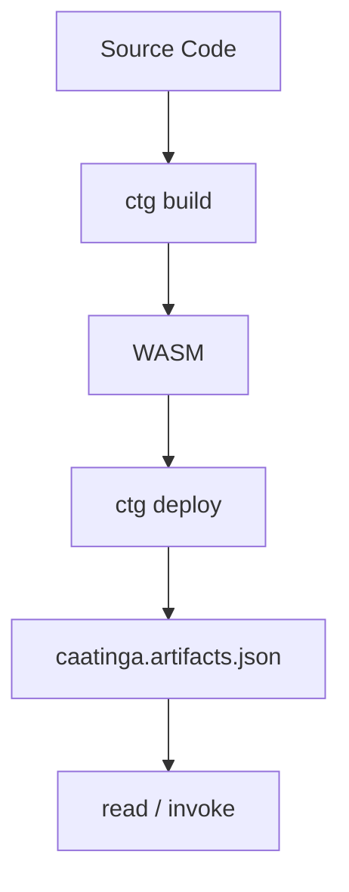
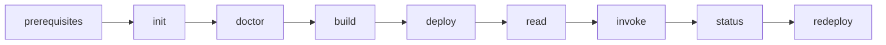
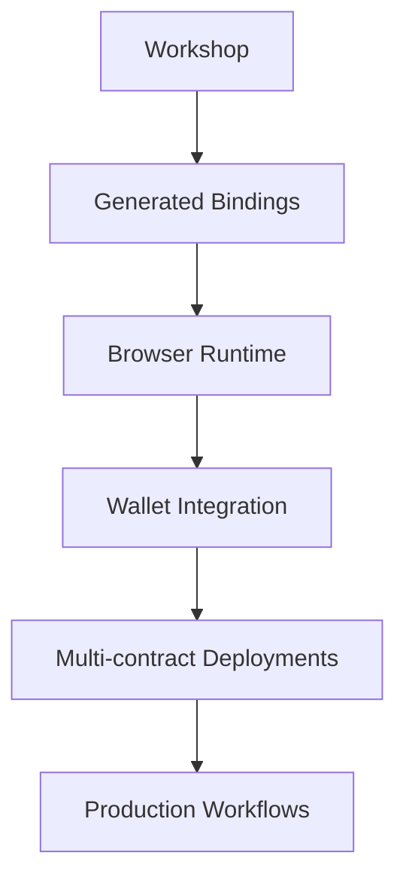

# Workshop: Contract Deployment with Caatinga

Hands-on path to scaffold, build, deploy, read, invoke, and redeploy the **counter** contract from the
default `react-vite-counter` template on Testnet. Target length: about 60–75 minutes. The scaffold includes
a Vite + React UI; this session focuses on the CLI deployment lifecycle (UI is optional at the end).

---

## Why Caatinga?

Deploying Soroban smart contracts typically involves orchestrating multiple separate tools, creating several friction points for developers:

- **Tool fragmentation**: Working with Soroban requires coordinating Node.js scripts, Rust compilers, and the Stellar CLI manually.
- **Shared state complexity**: Deployment state is hard to share across teams, often leading to out-of-sync environments.
- **Manual copy-pasting**: Developers frequently copy contract IDs by hand into frontend configurations and environment files, which is error-prone.
- **No shared source of truth**: CI/CD pipelines and teammates lack a unified, version-controlled record of deployed addresses.

**Caatinga** solves these problems. It orchestrates the official Stellar workflow while keeping your deployment state versioned in Git as a single source of truth.

<details>
<summary>Speaker Notes</summary>
Spend about a minute on the pain first: many tools, no shared deploy record, IDs pasted by hand.
Then land the punchline: Caatinga does not replace Stellar — it orchestrates the official toolchain and versions `caatinga.artifacts.json` in Git so teammates and CI share the same reality.
</details>

---

## Visual Mental Model

This is the **data pipeline** behind Caatinga — what happens to source, binaries, and recorded state. It is not the full session agenda (that comes next).



<details>
<summary>Speaker Notes</summary>
Walk the arrow once out loud. Build only produces WASM. Deploy uploads and creates the instance.
Artifacts store the resulting `contractId`. Read and invoke then resolve that ID from artifacts — nobody pastes addresses by hand.
</details>

---

## Canonical Workflow

This is the **session agenda**: every stage you will run hands-on, including prerequisites and redeploy. The middle of this path (`build` → `deploy` → `read` / `invoke`) is the pipeline above.



- **prerequisites**: Install Node, Rust, Stellar CLI, and a funded Testnet identity manually.
- **init**: Scaffold `react-vite-counter` (contract `counter` + Vite UI).
- **doctor**: Environment and credentials check.
- **build**: Rust → WASM (no network).
- **deploy**: Upload, instantiate, record `contractId`.
- **read**: Read-only simulation of `counter.get` (no fee / no signature).
- **invoke**: State-changing call to `counter.increment` (signs + fees).
- **status**: Compare artifacts with the network.
- **redeploy**: New instance; prior ID kept in history.

<details>
<summary>Speaker Notes</summary>
Do not dive into flags yet. Name each stage in order so participants know where they are in the session.
Emphasize that doctor comes before build/deploy — catching environment issues early saves the most time in a live room.
Contrast with the previous diagram: that one is “what files change”; this one is “what we will type today.”
</details>

---

## Two Things to Remember

Every Caatinga project is defined by two files:

| File                      | Meaning                                    |
| ------------------------- | ------------------------------------------ |
| `caatinga.config.ts`      | Desired deployment configuration           |
| `caatinga.artifacts.json` | Actual deployed state (commit this to Git) |

> **Remember**
>
> Configuration is intent.
>
> Artifacts are reality.

<details>
<summary>Speaker Notes</summary>
Repeat the phrase out loud: configuration is intent; artifacts are reality.
Config declares what you want to deploy. Artifacts record what is on-chain.
Later commands such as `read` and `status` resolve the contract from artifacts, so teams never paste IDs by hand.
</details>

---

## 1. Setup

### Purpose

Prepare the machine: Node.js 22+, Rust with the WASM target, Stellar CLI, and a funded Testnet identity. Later commands use `--source alice` — that value is a **local Stellar CLI identity alias**, not a public `G…` address or secret `S…` key.

### Command

```bash
node --version
npx ctg doctor --network testnet --source alice
```

### Expected Result

- Node.js 22 or newer available.
- Rust and its WASM target installed.
- Stellar CLI installed.
- A Testnet identity named `alice` created and funded.

<details>
<summary>Speaker Notes</summary>
Before the workshop, ensure every participant has installed Rust, the WASM target, and Stellar CLI manually. Doctor verifies everything is in place.
Stress that `alice` is an identity alias — public and secret keys are rejected on purpose.
</details>

### What changed?

- System binaries (Rust, Stellar CLI) are available on your `PATH`.
- Stellar CLI has a local identity alias named `alice` with a funded test balance.

### ✅ Checkpoint

Verify you have:

- [ ] Node.js 22+ (`node --version`)
- [ ] Rust compiler installed (`rustc --version`)
- [ ] Stellar CLI installed (`stellar --version`)
- [ ] Testnet identity `alice` created and funded

---

## 2. Scaffold

### Purpose

Scaffold the default **react-vite-counter** template: Soroban `counter` contract (`get` / `increment`),
Caatinga config, artifacts file, and a Vite + React frontend. This workshop stays on the CLI deploy loop;
the UI is there when you want it later ([Template project](./template-project.md)). For CLI-only scaffolds,
see [Minimal project](./minimal-project.md).

### Command

```bash
npx ctg init my-dapp
cd my-dapp
npm install
```

### Expected Result

A new directory `my-dapp` with:

| Path                      | Purpose                                                    |
| ------------------------- | ---------------------------------------------------------- |
| `contracts/counter/`      | Rust / Soroban counter (`get`, `increment`)                |
| `caatinga.config.ts`      | Declares contract `counter` and networks (intent)          |
| `caatinga.artifacts.json` | Empty network slots until the first successful deploy      |
| `src/`                    | Vite + React app (optional for this session)               |
| `package.json`            | Scripts for `build`, `deploy`, `dev`, and Caatinga helpers |

<details>
<summary>Speaker Notes</summary>
Default `init` ships `react-vite-counter`. Highlight `contracts/counter` and that `caatinga.config.ts` is intent while `caatinga.artifacts.json` has empty `contracts` until deploy.
Tell the room they can ignore the frontend until after the CLI loop.
</details>

### What changed?

- Local workspace scaffolded from `react-vite-counter`.
- Configuration initialized with deployment intent for `counter`.
- Artifacts file created with empty contract slots for `testnet`.

#### Before scaffold

- Directory `my-dapp` does not exist.

#### After scaffold

`caatinga.artifacts.json` (illustrative):

```json
{
  "project": "my-dapp",
  "version": 2,
  "networks": {
    "testnet": {
      "contracts": {},
      "dependencyGraph": {}
    }
  }
}
```

### ✅ Checkpoint

Verify you have:

- [ ] Directory `my-dapp` created
- [ ] `contracts/counter/` present
- [ ] `caatinga.config.ts` present
- [ ] `caatinga.artifacts.json` present with empty `networks.testnet.contracts`
- [ ] Node dependencies installed (`npm install` completed)

---

## 3. Doctor

### Purpose

Run diagnostics so config, binaries, network connectivity, and credentials are ready before you build or deploy.

### Command

```bash
npx ctg doctor --network testnet --source alice
```

### Expected Result

- Checks pass for Node.js, Stellar CLI, Rust, and WASM.
- `caatinga.config.ts` loads successfully.
- Identity `alice` resolves with a positive balance.
- An untested Stellar CLI version warning (if any) is usually advisory.

<details>
<summary>Speaker Notes</summary>
Doctor is the safety net. Always run it before deploy in a live room.
It checks machine tools and Stellar-specific state, including whether `alice` has enough XLM.
</details>

### What changed?

- No files changed.
- Environment diagnostics completed.

### ✅ Checkpoint

Verify you have:

- [ ] Doctor reports ready / all critical checks green

---

## 4. Build

### Purpose

Compile the Rust contract into a WebAssembly (`.wasm`) artifact. Nothing is deployed in this step.

### Command

```bash
npx ctg build counter
```

### Expected Result

- Compilation finishes successfully.
- WASM written under the path in config (for example `contracts/counter/target/wasm32v1-none/release/counter.wasm`).

<details>
<summary>Speaker Notes</summary>
At this stage we only compile to WASM. Nothing hits the network.
The next step uploads that file and records the resulting contract ID.
</details>

### What changed?

- Rust source became a WASM binary.
- No network changes.

### ✅ Checkpoint

Verify you have:

- [ ] Generated WASM file in the build / target directory

---

## 5. Deploy

### Purpose

Upload the WASM to Stellar Testnet, instantiate the contract, and record the `contractId` in artifacts so teammates and CI share one source of truth.

### Command

```bash
npx ctg deploy counter --network testnet --source alice
```

### Expected Result

- WASM uploaded (WASM hash registered).
- Contract instance created.
- `caatinga.artifacts.json` updated under `networks.testnet.contracts.counter`.
- TypeScript bindings generated for the frontend (under `src/contracts/generated/`).

<details>
<summary>Speaker Notes</summary>
Deploy does two network operations: upload WASM (hash) and instantiate (contract ID).
Caatinga then writes the ID into artifacts. That is the moment intent becomes recorded reality.
</details>

### What changed?

- WASM uploaded to Testnet.
- Contract instance created on-chain.
- Artifacts updated with deployment details.

#### Before deploy

Artifacts still have empty `networks.testnet.contracts` (same shape as after scaffold).

#### After deploy

`caatinga.artifacts.json` (illustrative — IDs and hashes will differ on your machine):

```json
{
  "project": "my-dapp",
  "version": 2,
  "networks": {
    "testnet": {
      "dependencyGraph": {
        "counter": []
      },
      "contracts": {
        "counter": {
          "contractId": "CA3D5RW6TZJ4U6CUAO723NX2A4ZCA7B6HW534T2WF62DOT6QX6H7CE7G",
          "wasmHash": "5e1f0e26d7f8d7f8d7f8d7f8d7f8d7f8d7f8d7f8d7f8d7f8d7f8d7f8d7f8d7f8",
          "deployedAt": "2026-07-30T15:02:46Z",
          "sourcePath": "contracts/counter",
          "wasmPath": "contracts/counter/target/wasm32v1-none/release/counter.wasm",
          "dependencies": [],
          "resolvedDeployArgs": {}
        }
      }
    }
  }
}
```

### ✅ Checkpoint

Verify you have:

- [ ] Deployed contract instance on Stellar Testnet
- [ ] `networks.testnet.contracts.counter.contractId` present in `caatinga.artifacts.json`

### Interactive questions

> **Question**: Where is the contract ID stored?

<details>
<summary>Answer</summary>
In `caatinga.artifacts.json` at `networks.testnet.contracts.counter.contractId`.
</details>

---

## 6. Read

### Purpose

Simulate a read-only call to `counter.get`. This path does not submit a ledger transaction, does not require a signature, and does not pay fees.

### Command

```bash
npx ctg read counter.get --network testnet
```

### Expected Result

- Simulated output printed in the terminal (typically `0` before any increment).
- Contract methods resolve using the ID stored in artifacts.

<details>
<summary>Speaker Notes</summary>
Read is a simulation against the RPC node — fast and free.
Next we will `invoke` `increment`, which changes state, signs with `--source`, and incurs fees.
</details>

### What changed?

- Read-only simulation executed.
- No transaction signed or broadcast.
- No fees paid.

### ✅ Checkpoint

Verify you have:

- [ ] Successful `counter.get` output in the terminal

### Interactive questions

> **Question**: Did this transaction require a signature?

<details>
<summary>Answer</summary>
No. Read operations are query simulations. They do not write state, sign transactions, or require fees.
</details>

---

## 7. Invoke

### Purpose

Submit a state-changing call to `counter.increment`. Unlike `read`, this path signs with the identity alias, broadcasts a transaction, and pays fees.

### Command

```bash
npx ctg invoke counter.increment --network testnet --source alice
npx ctg read counter.get --network testnet
```

### Expected Result

- `increment` returns the new count (for example `1`).
- A follow-up `get` shows the updated value.

<details>
<summary>Speaker Notes</summary>
This is the contrast pair: `read` is free simulation; `invoke` mutates on-chain state.
Both resolve `contractId` from artifacts — still no hand-copied addresses.
</details>

### What changed?

- Transaction signed with identity `alice` and submitted.
- Counter storage updated on Testnet.
- Fees paid for the invoke.

### ✅ Checkpoint

Verify you have:

- [ ] Successful `counter.increment` in the terminal
- [ ] `counter.get` reflects the new value

### Interactive questions

> **Question**: Where did Caatinga get the contract address for invoke?

<details>
<summary>Answer</summary>
From `caatinga.artifacts.json` (`networks.testnet.contracts.counter.contractId`), not from a pasted `C…` address.
</details>

---

## 8. Status

### Purpose

Compare local artifacts with what the network reports for the deployed contract.

### Command

```bash
npx ctg status --network testnet
```

### Expected Result

- Contract `counter` shown as deployed on `testnet` with the active ID from local artifacts.

<details>
<summary>Speaker Notes</summary>
Status confirms the locally recorded contract ID exists on-chain and surfaces the WASM hash it is running.
</details>

### What changed?

- No files changed.
- Network status query completed.

### ✅ Checkpoint

Verify you have:

- [ ] Local artifacts and network status agree for `counter`

---

## 9. Redeploy (Upgrades)

### Purpose

Two upgrade strategies exist. This workshop demonstrates **redeploy** because the counter template does not implement an in-place `upgrade` entrypoint.

| Strategy     | Command                | Effect                                        | `contractId` |
| ------------ | ---------------------- | --------------------------------------------- | ------------ |
| **In-place** | `ctg upgrade`          | New WASM on the same instance                 | Unchanged    |
| **Redeploy** | `ctg deploy --upgrade` | New instance; old ID kept in artifact history | New ID       |

Details: [Contract upgrade](./contract-upgrade.md).

### Command

```bash
npx ctg build counter
npx ctg deploy counter --upgrade --network testnet --source alice
```

### Expected Result

- A new contract instance is created.
- Active `contractId` in artifacts is updated.
- Previous ID moves into the `history` array.
- Note: the new instance starts with a fresh counter (state does not move with redeploy).

<details>
<summary>Speaker Notes</summary>
Stellar supports in-place WASM replacement (same ID) and redeploy (new ID).
The counter stub lacks the upgrade/auth entrypoint, so we use `--upgrade` to create a new instance and keep history in artifacts.
Clients must follow the new active ID — another reason to version artifacts in Git.
Mention that on-chain counter state resets because this is a new instance.
</details>

### What changed?

- New contract instance on-chain.
- Active ID updated; previous ID archived under `history`.

#### Before redeploy

`caatinga.artifacts.json` (illustrative, abbreviated):

```json
{
  "project": "my-dapp",
  "version": 2,
  "networks": {
    "testnet": {
      "contracts": {
        "counter": {
          "contractId": "CA3D5RW6TZJ4U6CUAO723NX2A4ZCA7B6HW534T2WF62DOT6QX6H7CE7G",
          "wasmHash": "5e1f0e26d7f8d7f8d7f8d7f8d7f8d7f8d7f8d7f8d7f8d7f8d7f8d7f8d7f8d7f8",
          "deployedAt": "2026-07-30T15:02:46Z"
        }
      }
    }
  }
}
```

#### After redeploy

`caatinga.artifacts.json` (illustrative, abbreviated — IDs will differ):

```json
{
  "project": "my-dapp",
  "version": 2,
  "networks": {
    "testnet": {
      "contracts": {
        "counter": {
          "contractId": "CC7Y6EXAMPLENEWCONTRACTID0000000000000000000000000000000",
          "wasmHash": "9a2b3c4d5e6f7890abcdef1234567890abcdef1234567890abcdef1234567890",
          "deployedAt": "2026-07-30T15:20:00Z",
          "history": [
            {
              "contractId": "CA3D5RW6TZJ4U6CUAO723NX2A4ZCA7B6HW534T2WF62DOT6QX6H7CE7G",
              "wasmHash": "5e1f0e26d7f8d7f8d7f8d7f8d7f8d7f8d7f8d7f8d7f8d7f8d7f8d7f8d7f8d7f8",
              "deployedAt": "2026-07-30T15:02:46Z",
              "supersededAt": "2026-07-30T15:20:00Z",
              "reason": "upgrade",
              "upgradeType": "new-contract"
            }
          ]
        }
      }
    }
  }
}
```

### ✅ Checkpoint

Verify you have:

- [ ] Redeploy completed
- [ ] Previous `contractId` present under `networks.testnet.contracts.counter.history`

### Interactive questions

> **Question**: Which contract ID is now active?

<details>
<summary>Answer</summary>
The newly generated contract ID is active. The old ID is in `history` under `networks.testnet.contracts.counter`.
</details>

---

## 10. Demonstrate a Real Error

### Purpose

Intentionally trigger a common failure so you recognize the stable `CAATINGA_*` code and know how to fix it.

### Command

```bash
npx ctg deploy counter --network testnet --source GAAAAAAAAAAAAAAAAAAAAAAAAAAAAAAAAAAAAAAAAAAAAAAAAAAAAWHF
```

### Expected Result

```
CAATINGA_SOURCE_IS_PUBLIC_KEY
```

<details>
<summary>Speaker Notes</summary>
This shows Caatinga protecting the operator. Public `G…` keys cannot sign; secret `S…` keys must never appear on the CLI.
Always use a Stellar CLI identity alias such as `alice`.
</details>

### What changed?

- CLI aborted before submitting any transaction.
- Error code `CAATINGA_SOURCE_IS_PUBLIC_KEY` was raised.

### Why the error occurs

Stellar CLI signs with local identity aliases. A raw public key (`G…`) cannot sign. A raw secret key (`S…`) is unsafe in shell history.

### How to fix it

Use a registered identity alias, for example `--source alice`.

### Codes worth recognizing

| Situation                            | Code                             | Fix                                           |
| ------------------------------------ | -------------------------------- | --------------------------------------------- |
| Build artifact missing before deploy | `CAATINGA_ARTIFACT_NOT_FOUND`    | Run `ctg build` first                         |
| `stellar` missing from `PATH`        | `CAATINGA_STELLAR_CLI_NOT_FOUND` | Install Stellar CLI; verify with `ctg doctor` |
| `--source` is a public `G…` address  | `CAATINGA_SOURCE_IS_PUBLIC_KEY`  | Use an identity alias such as `alice`         |
| `--source` is a secret `S…` key      | `CAATINGA_SOURCE_IS_SECRET_KEY`  | Same: alias only; never paste keys on the CLI |

---

## Key Takeaways

- Always run `ctg doctor` first.
- Never edit `caatinga.artifacts.json` manually — commit the file Caatinga writes.
- Never copy contract IDs by hand; resolve them from artifacts.
- Use Stellar CLI identity aliases (`alice`, `bob`) — never raw `G…` / `S…` keys.
- Config is intent; artifacts are reality (see [Two Things to Remember](#two-things-to-remember)).

<details>
<summary>Speaker Notes</summary>
Close by restating the operational rules: doctor first, never hand-edit artifacts, aliases only.
Point back to intent vs reality — do not re-teach the whole pipeline.
</details>

---

## Next Learning Path



---

## Command checklist

Copy-paste loop for the session (same agenda as [Canonical Workflow](#canonical-workflow)):

```bash
node --version
npx ctg doctor --network testnet --source alice

npx ctg init my-dapp
cd my-dapp
npm install

npx ctg doctor --network testnet --source alice
npx ctg build counter
npx ctg deploy counter --network testnet --source alice
npx ctg read counter.get --network testnet
npx ctg invoke counter.increment --network testnet --source alice
npx ctg read counter.get --network testnet
npx ctg status --network testnet

npx ctg build counter
npx ctg deploy counter --upgrade --network testnet --source alice
npx ctg status --network testnet
```

Optional UI after deploy:

```bash
npm run dev
```

---

## Next Steps

- [Cheatsheet](../cheatsheet.md) — command loop on one page
- [CLI reference](../cli.md) — flags and subcommands
- [Template project](./template-project.md) — what `react-vite-counter` generates
- [Minimal project](./minimal-project.md) — CLI-only `--minimal` scaffold
- [From Zero to Testnet](./from-zero-to-testnet.md) — fuller walkthrough
- [Contract upgrade](./contract-upgrade.md) — in-place vs redeploy
- [Troubleshooting](../troubleshooting.md) — symptom-first fixes
